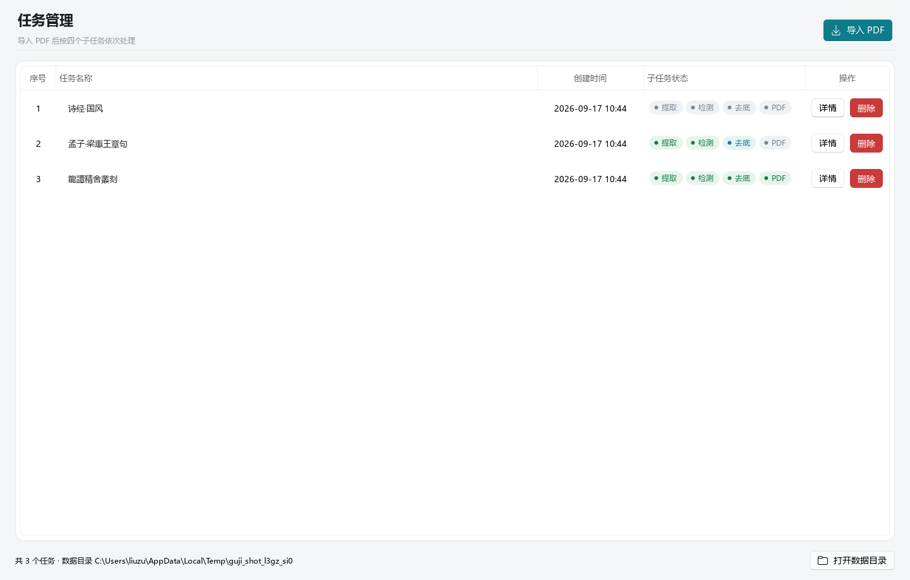
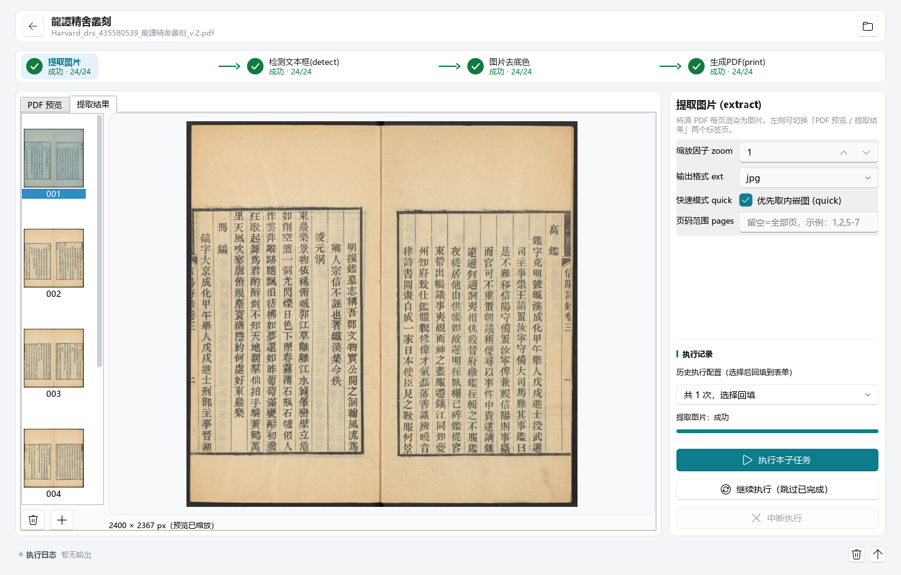
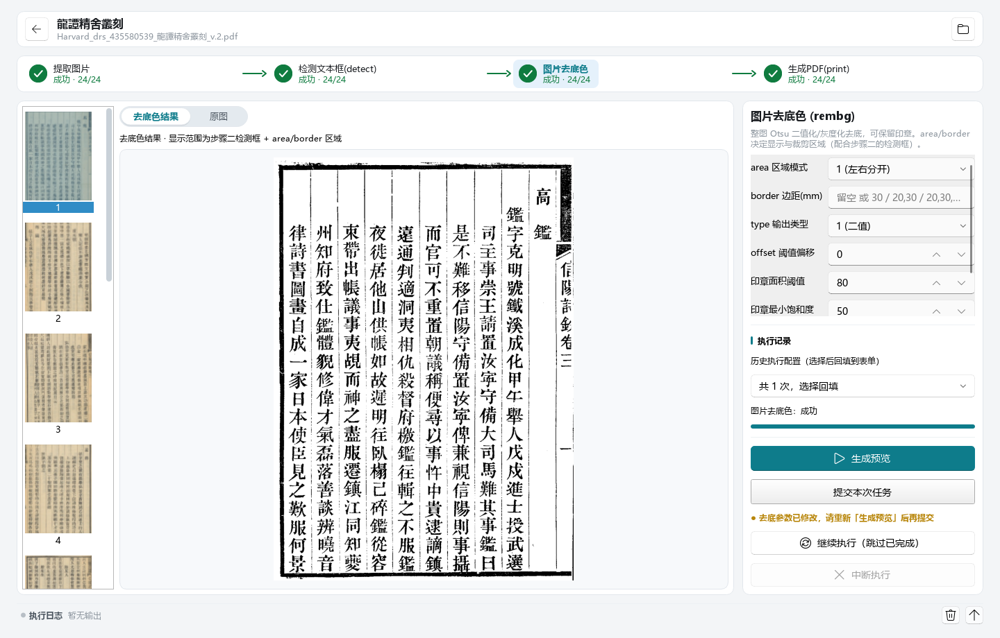
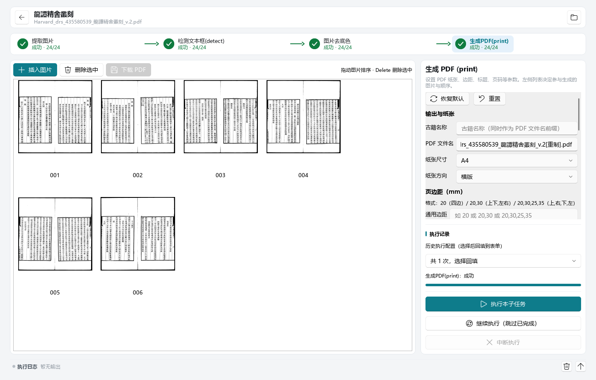
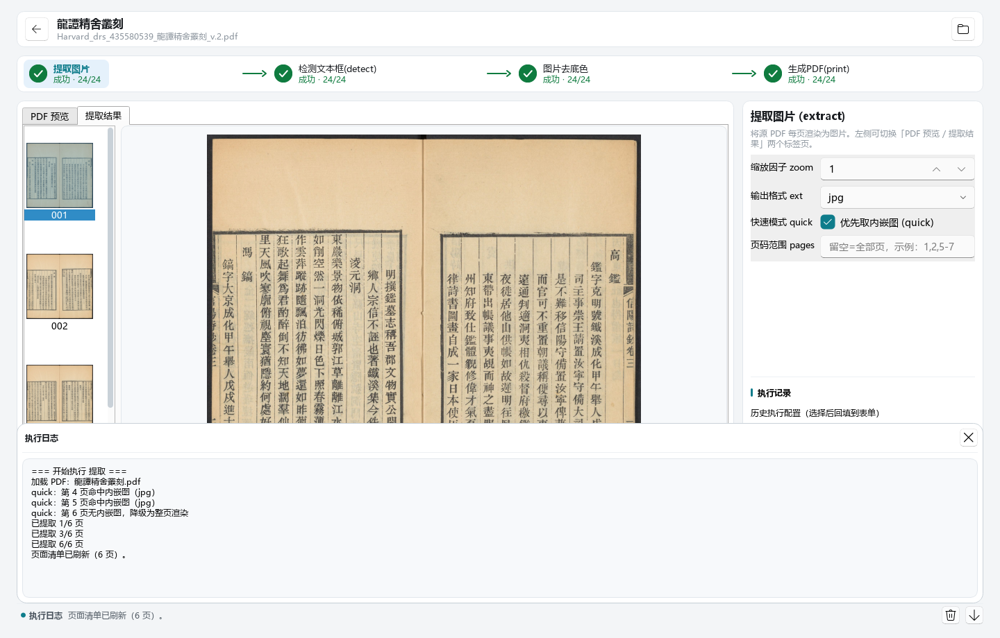

# 桌面端布局文档（与 desktop/ 当前实现对齐）

## 1. 主窗口

- 默认 1440×920，最小 1080×720，标题「古籍重製」；QStackedWidget 切换
  任务列表页 / 任务详情页。页面根节点 `objectName=pageRoot`，统一走全局底色。
- 字体/主题色/底色在创建窗口前由 `apply_app_style(app)` 设置（见
  [gui-ui-system.md](gui-ui-system.md)）。

## 2. 任务列表页

```
┌──────────────────────────────────────────────┐
│ 任务管理（页面头：标题 + 副标题）    [导入PDF] │
├──────────────────────────────────────────────┤
│ ┌── 卡片 ──────────────────────────────────┐ │
│ │ 序号|任务名|创建时间|子任务状态|操作        │ │
│ │  1 |…|…| ●提取 ●检测 ●去底 ●PDF |详情 删除 │ │
│ └──────────────────────────────────────────┘ │
├──────────────────────────────────────────────┤
│ 共 N 个任务    数据目录：…        [打开数据目录] │
└──────────────────────────────────────────────┘
```



- 表格列固定为 5 列（序号/任务名/创建时间/子任务状态/操作）；**不单独展示源文件
  路径**，源路径放在任务名的悬浮提示里。
- 「任务名称」列自适应拉伸、占主要宽度；「子任务状态」列固定 256px（4 个
  胶囊的实际宽度）。表头对齐均为水平分量 + `AlignVCenter` 垂直居中。
- 「删除」按钮使用 `theme.DANGER` 危险色（实例级样式表，normal/hover/
  pressed/disabled 四态写全），在一排灰白按钮里一眼可辨。
- "子任务状态"每行是 4 个 `StatusChip`（提取/检测/去底/PDF），颜色由
  `theme.status_colors` 决定；已完成绿、执行中主色、未执行灰、失败红。
- 单元格容器（`StageChips`、操作列按钮容器）必须 `setFixedHeight(ROW_HEIGHT)`
  锁定为整行高：qfluent 的 `TableItemDelegate.updateEditorGeometry` 用「改高度
  前」的容器高算垂直居中偏移、随后又把高度改成整格高，容器高度不等于行高时
  位置随几何更新时序漂移（运行中胶囊/按钮会偏到行底，且离屏探针因时序不同
  未必能复现）。锁定后 `y = rect.y` 恒成立，内容由内部布局垂直居中。
- 无任务时表格卡片整体替换为 `EmptyState`（图标 + 文案 + 引导）。

## 3. 任务详情页

```
┌──────────────────────────────────────────────────────┐
│ ┌── 卡片 ────────────────────────────────────────┐   │
│ │ [←] 任务名  <源文件名>                [打开目录] │   │
│ └────────────────────────────────────────────────┘   │
│ ┌── 步骤条（自绘，无卡片包裹） ───────────────────┐   │
│ │ ①提取 ──▶ ②检测 ──▶ ③去底色 ──▶ ④生成PDF       │   │
│ └────────────────────────────────────────────────┘   │
│ ┌── 预览卡片 ───────────────┐ ┌── 控制卡片 ──────┐   │
│ │                           │ │ 阶段标题/说明     │   │
│ │      预览区（随阶段切换）   │ │ ── 阶段参数 ──   │   │
│ │                           │ │ ── 执行记录 ──   │   │
│ │                           │ │ [执行][续跑]     │   │
│ │                           │ │ [中断]          │   │
│ └───────────────────────────┘ └─────────────────┘   │
│ ──────────────────────────────────────────────────── │
│ ● 执行日志  最近一条输出（出错标红）      [清空][展开] │
└──────────────────────────────────────────────────────┘
```



- 顶部信息卡、预览区、控制列各自是独立 `Card`；步骤条与底部日志状态条直接画在
  页面底色上（状态条只有一条 1px 上分隔线，不套卡片）。
- 预览区占满剩余宽度；控制列限宽 340–440px（第四步参数较多，放宽到 400–580px，
  由 `_apply_control_width()` 按阶段切换）。
- 预览区按阶段：
  - extract：QTabWidget [PDF 预览 | 提取结果]；
  - detect：图片查看器（缩略图条 + 大图，框叠加/手柄）；
  - rembg：输出条目列表 + 顶部[去底色结果|原图]切换 + 单视图；
  - print：图片瀑布流（工具条：插入/删除/拖动排序）。
- 各阶段参数表单统一由 `StagePanel.build_form()` 装进透明 `ScrollArea`：
  控制列高度不足时表单保持自然高度、纵向滚动，不再被压得行距错位
  （print 面板自带分区滚动区，整体覆盖该方法）。
- 日志分两层：底部**状态条**（常驻一行 34px：状态圆点 + 最近一条输出 + 清空/展开
  按钮；空闲灰、有输出主色、出错红）与**浮层**（点击状态条唤出，盖在预览区之上而
  **不挤压**布局；Esc 或点击浮层外关闭）。执行阶段时自动唤出浮层。

其余阶段截图：

| 检测文本框                                       | 图片去底色                                           |
| ------------------------------------------------ | ---------------------------------------------------- |
|  |  |



日志浮层（点击底部状态条唤出）：



> 截图由 `tests/gui_shot.py` 离屏渲染生成（演示数据，文件名与 `docs/guide/screenshots/`
> 一致，可直接覆盖使用），改界面后可重跑覆盖。

## 4. 组件尺寸约定

- 页面缩略图条：条目图标 96×128，列表宽 132px；
- 页缩略图磁盘规格：256px 长边 JPEG（源缩略图 `0001.jpg`…，4 位补零）；
- 控制列：min 340 / max 440（第四步 400–580）；
- 日志状态条：固定高 34px；日志浮层默认高 260px，随状态条上方空间自适应
  （不小于 140px），宽度与状态条对齐。
