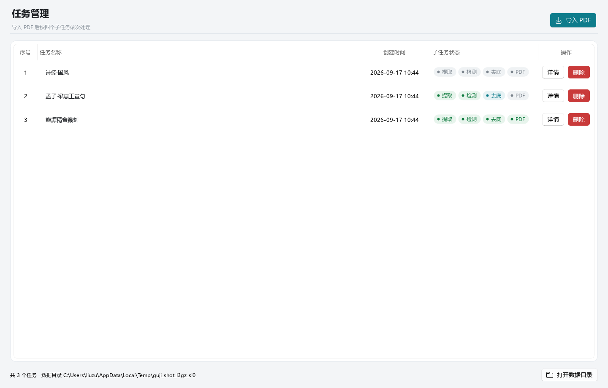
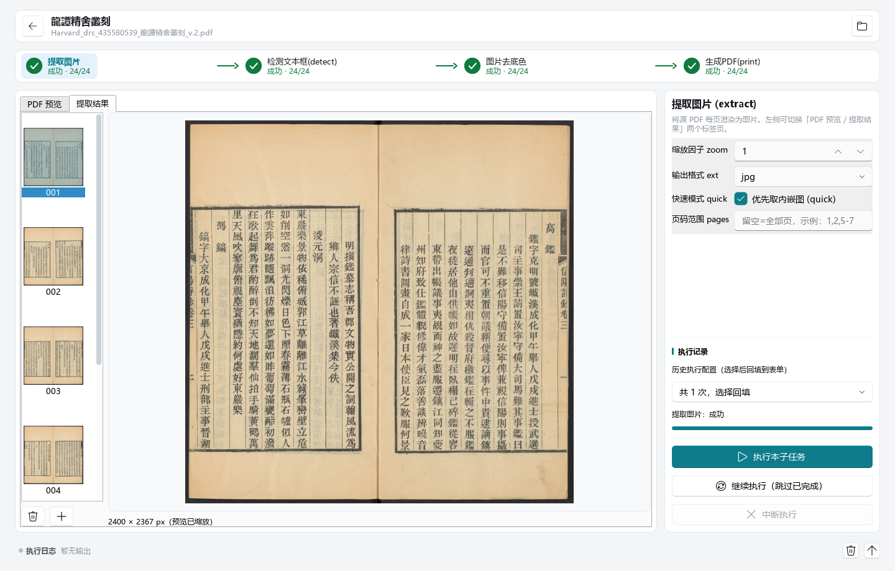
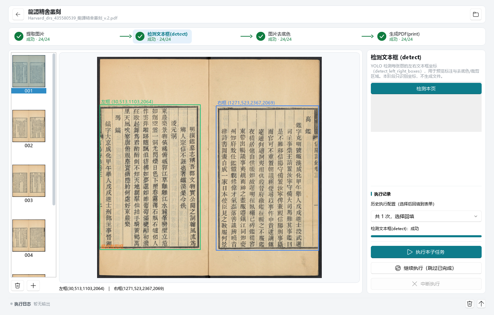
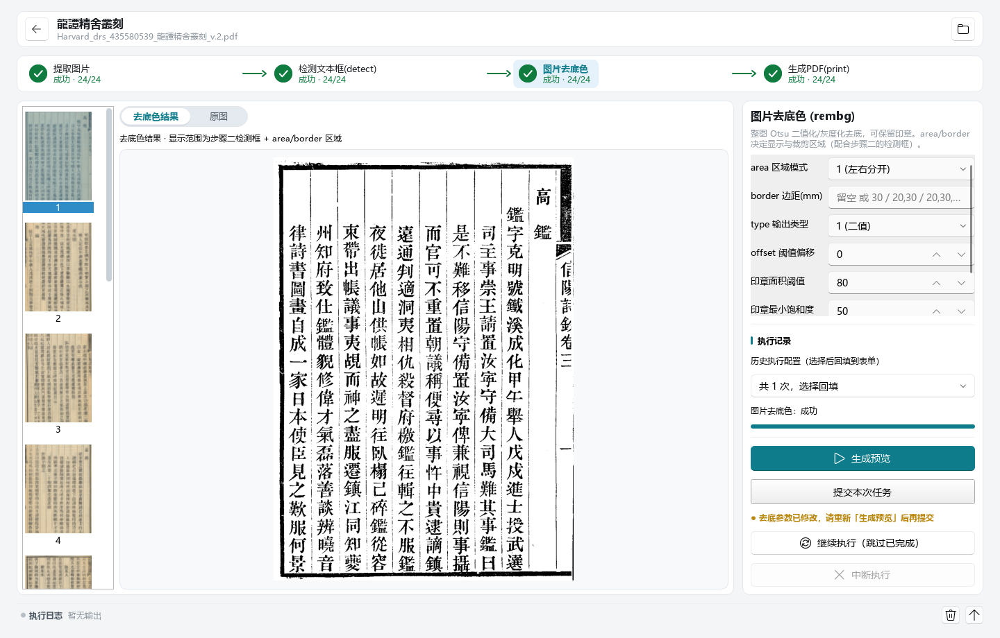
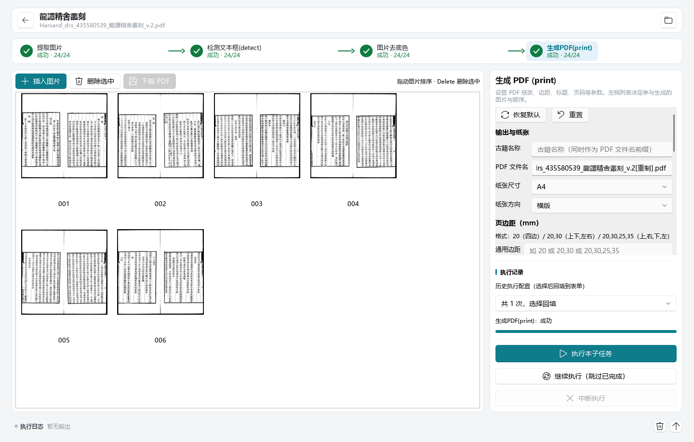
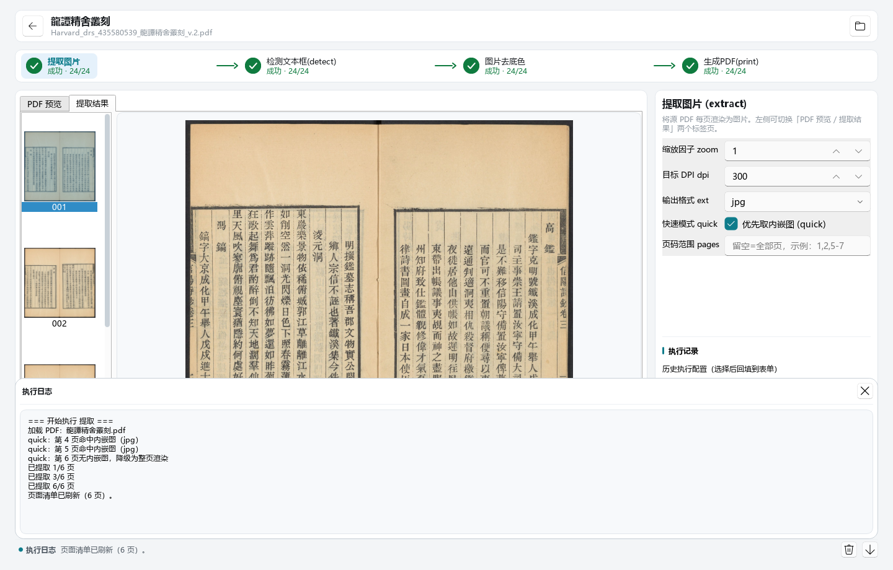

# 桌面端布局文档（与 desktop/ 当前实现对齐）

## 1. 主窗口

- **启动即最大化**（`desktop/app.py` 的 `WINDOW_START_MAXIMIZED`，用户
  2026-10-01 定：「我这个 1920 的屏幕默认就占满屏幕吧，现在默认宽度跟 1920
  差不了多少，最大化最小化没什么意义」——夹紧后的默认宽度已经是可用宽度的
  94%，留的 96px 除了露出桌面没用）。冒烟模式
  （`GUJI_GUI_SELFTEST`）仍走 `show()`，不依赖窗口管理器。
- 期望尺寸 1440×920、最小尺寸 1080×720，标题「古籍重製」；QStackedWidget
  切换任务列表页 / 任务详情页。页面根节点 `objectName=pageRoot`，统一走全局
  底色。因为默认最大化，这两个值的实际角色是**还原尺寸**（点「还原」/双击
  标题栏时落到的大小）。
- 这两个是**期望值**（`WINDOW_SIZE` / `WINDOW_MIN_SIZE`），落地前一律经
  `apply_window_size()` 按屏幕夹一次，见 §1.1。
- 字体/主题色/底色在创建窗口前由 `apply_app_style(app)` 设置（见
  [gui-ui-system.md](gui-ui-system.md)）。
- ⚠️ 连带约束：单例守卫把已有窗口带到前台时**只在窗口最小化时才用
  `SW_RESTORE`**（`desktop/single_instance.py`）。`SW_RESTORE` 会把最大化的
  窗口一并还原，默认最大化之后那就是"再点一次快捷方式，窗口自己缩回去了"。

### 1.1 尺寸适配与最小支持屏幕

统一入口 `desktop/ui/window_size.py::apply_window_size(window, preferred, minimum)`，
主窗口与四个大弹窗（图片预览 1360×860、图片编辑 1440×940 / 最小 1000×680、
拼版选图 1000×680、缺字体引导 760×620）都走它，规则**只夹不涨**：

1. 期望宽高先扣掉 `FRAME_ALLOWANCE`（标题栏 32 逻辑像素，实测 125% 缩放下
   客户端 782 高的窗口 `frameGeometry` 是 812），再各夹到**屏幕可用区域**
   （`availableGeometry()`，已扣任务栏）的 `FIT_RATIO = 0.95`；
2. 最小宽高**跟着夹**，否则"可用高 672 < 最小高 720"时用户连拖小都做不到；
3. 位置一并摆正：弹窗居中到可见父窗口、顶层窗口居中到屏幕，居中与夹紧都按
   **含标题栏的外框**算。

> 为什么不查屏幕就出事（2026-10-01 用户报障「不最大化显示不完整 / 被任务栏
> 遮挡」）：尺寸是逻辑像素的固定值，而逻辑像素 = 物理像素 ÷ 系统缩放。
> 1920×1080 @125% → 逻辑屏 1536×864，减去任务栏可用高只有 824，默认的 920
> 高会让窗口底部（日志状态条、第四步按钮）永远压在任务栏后面。

> 默认最大化之后，下面这张表的作用变成**还原尺寸**表（用户点「还原」时落到
> 的大小）；"这台机器上放不放得下"的判据不变，最大化只是把尺寸决定权交给
> 系统（系统保证最大化窗口正好铺满工作区、不吃任务栏）。

各配置下的落地尺寸（夹紧后，括号内为改动前的旧默认）：

| 屏幕 | 缩放 | 逻辑可用区 | 主窗口落地（客户端） | 改动前 |
| --- | --- | --- | --- | --- |
| 1366×768 | 100% | 1366×728 | 1282×661 | ★ 920 高超出 |
| 1366×768 | 125% | 1092×574 | 1022×514（很挤，勉强可用） | ★★ 超出且拖不小 |
| 1600×900 | 100% | 1600×860 | 1440×786 | ★ 超出 |
| 1920×1080 | 100% | 1920×1040 | 1440×920（不变） | 放得下 |
| 1920×1080 | **125%** | 1536×824 | 1440×752 | ★★ **920 被任务栏吃掉 96px**（用户现场） |
| 1920×1080 | 150% | 1280×680 | 1200×615 | ★★ 超出且最小 720 拖不小 |
| 2560×1440 | 125% | 2048×1112 | 1440×920（不变） | 放得下 |
| 2560×1440 | 150% | 1706×920 | 1440×843 | ★ 标题栏那 30px 顶出去 |
| 3840×2160 | 200% | 1920×1032 | 1440×920（不变） | 放得下 |
| 3840×2160 | 250% | 1536×816 | 1440×744 | ★ 超出 |

**最小支持屏幕**（判据是"能不能把窗口缩进可用区域"，实测数据见下表）：

- **下限 ~1092×574 逻辑像素**（≈ 1366×768 @125%）：再小就没有任何可用空间，
  内容会被压到控制列滚动条里，仍能操作但很挤；
- **推荐 1280×720 逻辑像素以上**（= 1920×1080 @150% / 1366×768 @100%）：
  主窗口按期望值完整落地，只有"详情页控制列"会按需滚动；
- **完全不挤压需 ~1200×1000 逻辑像素**（= 1920×1080 @100%）：详情页的**自然
  下限实测 1032×953**，驱动它的是控制列卡片（下限 438×753，且"检测结果统计 +
  执行记录 + 按钮区"在滚动区**之外**）与图片预览弹窗工具条（下限宽 1186）。
  可用高不足 953 时，Qt 会把差额从预览区与控制列的滚动区里"抽"走——按钮与
  日志条仍然可见（1440×752 实测"执行"按钮底边 520 < 卡片高 624），所以是
  **压缩**而不是**裁掉**。

自测护栏：`tests/selftests/window_size.py`（纯函数边界 + 真窗口外框不越界）。

## 2. 任务列表页

```
┌──────────────────────────────────────────────┐
│ 任务管理（页面头：标题 + 副标题）    [导入PDF] │
├──────────────────────────────────────────────┤
│ ┌── 卡片 ──────────────────────────────────┐ │
│ │ 序号|任务名|创建时间|子任务状态|操作        │ │
│ │  1 |…|…| ●提取 ●检测 ●去底 ●PDF |详情 删除 │ │
│ └──────────────────────────────────────────┘ │
├──────────────────────────────────────────────┤
│ 共 N 个任务    数据目录：…        [打开数据目录] │
└──────────────────────────────────────────────┘
```



- 表格列固定为 5 列（序号/任务名/创建时间/子任务状态/操作）；**不单独展示源文件
  路径**，源路径放在任务名的悬浮提示里。
- 「任务名称」列自适应拉伸、占主要宽度；「子任务状态」列固定 256px（4 个
  胶囊的实际宽度）。表头对齐均为水平分量 + `AlignVCenter` 垂直居中。
- 「删除」按钮使用 `theme.DANGER` 危险色（实例级样式表，normal/hover/
  pressed/disabled 四态写全），在一排灰白按钮里一眼可辨。
- "子任务状态"每行是 4 个 `StatusChip`（提取/检测/去底/PDF），颜色由
  `theme.status_colors` 决定；已完成绿、执行中主色、未执行灰、失败红。
- 单元格容器（`StageChips`、操作列按钮容器）必须 `setFixedHeight(ROW_HEIGHT)`
  锁定为整行高：qfluent 的 `TableItemDelegate.updateEditorGeometry` 用「改高度
  前」的容器高算垂直居中偏移、随后又把高度改成整格高，容器高度不等于行高时
  位置随几何更新时序漂移（运行中胶囊/按钮会偏到行底，且离屏探针因时序不同
  未必能复现）。锁定后 `y = rect.y` 恒成立，内容由内部布局垂直居中。
- 无任务时表格卡片整体替换为 `EmptyState`（图标 + 文案 + 引导）。

## 3. 任务详情页

```
┌──────────────────────────────────────────────────────┐
│ ┌── 卡片 ────────────────────────────────────────┐   │
│ │ [←] 任务名  <源文件名>                [打开目录] │   │
│ └────────────────────────────────────────────────┘   │
│ ┌── 步骤条（自绘，无卡片包裹） ───────────────────┐   │
│ │ ①提取 ──▶ ②检测 ──▶ ③去底色 ──▶ ④生成PDF       │   │
│ └────────────────────────────────────────────────┘   │
│ ┌── 预览卡片 ───────────────┐ ┌── 控制卡片 ──────┐   │
│ │                           │ │ 阶段标题/说明     │   │
│ │      预览区（随阶段切换）   │ │ ── 阶段参数 ──   │   │
│ │ （第二步参数区下方显示     │ │ ── 执行记录 ──   │   │
│ │   「检测结果统计」，且不   │ │ [执行][续跑]     │   │
│ │   显示执行记录）          │ │ [中断]          │   │
│ └───────────────────────────┘ └─────────────────┘   │
│ ──────────────────────────────────────────────────── │
│ ● 执行日志  最近一条输出（出错标红）      [清空][展开] │
└──────────────────────────────────────────────────────┘
```



- 顶部信息卡、预览区、控制列各自是独立 `Card`；步骤条与底部日志状态条直接画在
  页面底色上（状态条只有一条 1px 上分隔线，不套卡片）。
- 预览区占满剩余宽度；控制列限宽 340–440px（第四步参数较多，放宽到 400–580px，
  由 `_apply_control_width()` 按阶段切换）。
- 预览区按阶段：
  - extract：QTabWidget [PDF 预览 | 提取结果]；
  - detect：图片查看器（缩略图条 + 大图，框叠加/手柄）；
  - rembg：输出条目列表 + 顶部[去底色结果|原图]切换 + 单视图；
  - print：缩略图条（拖动排序）+ 右侧打印效果预览（「打印效果/原图」切换），
    工具条：插入/删除/下载 PDF。
- 各阶段参数表单统一由 `StagePanel.build_form()` 装进透明 `ScrollArea`：
  控制列高度不足时表单保持自然高度、纵向滚动，不再被压得行距错位
  （print 面板自带分区滚动区，整体覆盖该方法）。
- 日志分两层：底部**状态条**（常驻一行 34px：状态圆点 + 最近一条输出 + 清空/展开
  按钮；空闲灰、有输出主色、出错红）与**浮层**（点击状态条唤出，盖在预览区之上而
  **不挤压**布局；Esc 或点击浮层外关闭）。执行阶段时自动唤出浮层。

其余阶段截图：

| 检测文本框                                       | 图片去底色                                           |
| ------------------------------------------------ | ---------------------------------------------------- |
|  |  |



日志浮层（点击底部状态条唤出）：



> 截图由 `tests/gui_shot.py` 离屏渲染生成（演示数据，文件名与 `docs/guide/screenshots/`
> 一致，可直接覆盖使用），改界面后可重跑覆盖。

## 4. 组件尺寸约定

- 页面缩略图条（`ThumbStrip`）：条目图标框 116×156、条目网格 124×188、列表宽 146px；
  缩略图**解码最长边取图标框的长边**（`ThumbStrip.DECODE_EDGE`，`ImageListWorker`
  的 `edge` 是"最长边"语义）——竖开本页面受高度约束，解码边按框宽取会让缩略图
  只占条目宽度的一半；实际解码边还要**乘 dpr**（`ThumbStrip.decode_edge(dpr)`），
  否则高分屏下条目被放大、缩略图发糊；
- 大图预览（`ImageView`）：出图与渲染密度都按**物理**像素（逻辑尺寸 × dpr）算
  （`preview_edge()`），dpr=1 时与旧行为一致；
- 页缩略图磁盘规格：256px 长边 JPEG（源缩略图 `0001.jpg`…，4 位补零）；
- 控制列：min 340 / max 440（第四步 400–580）；
- 日志状态条：固定高 34px；日志浮层默认高 260px，随状态条上方空间自适应
  （不小于 140px），宽度与状态条对齐。
