# 用户操作手册：桌面端（从导入到出 PDF）

面向**日常使用者**：不需要懂 Python、命令行或参数语法，照着点即可。

四个步骤固定顺序：**① 提取图片 → ② 检测文本框 → ③ 图片去底色 → ④ 生成 PDF**。
每一步满意后再进入下一步；中途可以随时中断，之后点「继续执行（跳过已完成）」只补没做完的部分。

> 本手册截图取自真实操作：以《龍譚精舍叢刻》（63 页、竖开本扫描件）为例，
> 演示页为**第 4 页**（左右两栏都排满的规整正文）。

---

## 0. 启动程序

```powershell
python desktop.py
# 或安装后从开始菜单运行「古籍重製」（可执行文件为 guji-desktop.exe）
```

数据目录默认在 `~/Documents/guji`，里面按任务号（`0001`、`0002`…）分目录存放
全部中间产物。删除任务即删除对应目录，程序不会在别处另存副本。

---

## 1. 导入 PDF

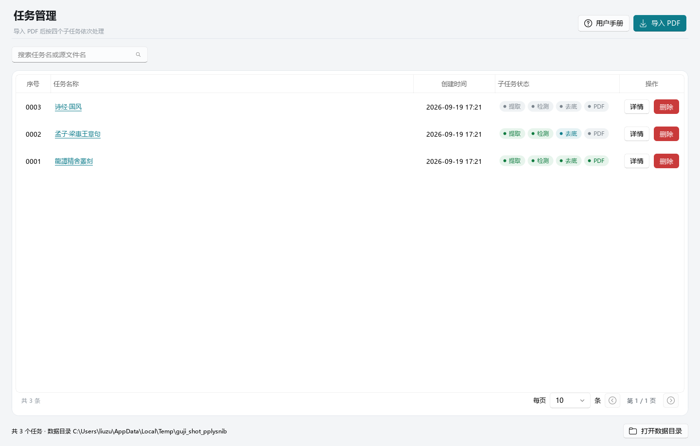

1. 点右上角 **「导入 PDF」**，选择要处理的扫描件；
2. 程序在后台计算文件指纹（按钮会短暂置灰），与已有任务比对：
   - **没有重复** → 直接创建任务；
   - **有重复** → 弹窗让你选「创建新任务」或「定位已有任务」。选定位会直接跳到已有任务，
     不会重复占用空间。

创建后会在后台逐页生成缩略图。列表中每个任务右侧有 4 个状态胶囊
（提取 / 检测 / 去底 / PDF），**灰色=未执行、蓝色=执行中、绿色=已完成、红色=失败**。

列表最左边的**「序号」就是任务编号**（`0001`、`0002`…），与数据目录里的任务目录一一对应；
排序、搜索、翻页都不会改变它，所以随时可以按号去找磁盘上的任务目录。

点 **「详情」** 进入操作页；**直接点任务名称**（蓝色带下划线的链接）也一样能进。
点 **「删除」** 会连同该任务的全部中间产物一起清理。

> 导入时程序会在任务目录里留一份 PDF 副本，后续所有步骤都用这份副本，
> 原始文件之后被移动或删除也不影响已导入的任务。

---

## 2. 第一步：提取图片（extract）

把 PDF 每页渲染成图片，作为后续所有步骤的输入。


左侧预览区有两个标签页：

- **PDF 预览**：看原始文件，用来和提取结果对照；
- **提取结果**：看实际渲染出来的页面，下方缩略图条可**删页 / 插页**。

右侧控制列填参数：

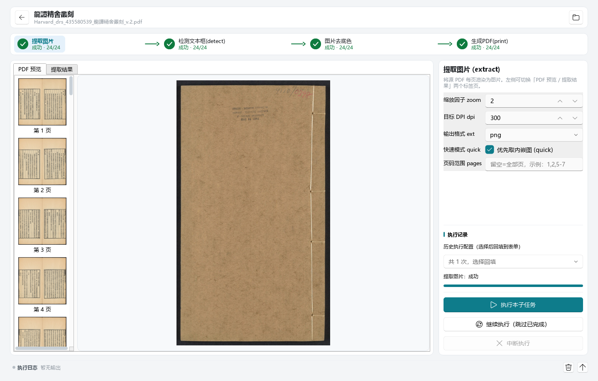

| 参数           | 说明                                    | 建议                                                          |
| -------------- | --------------------------------------- | ------------------------------------------------------------- |
| 缩放因子 zoom  | 渲染倍率，越大越清晰、文件越大          | 扫描件一般 `1`；字迹细小时用 `2`                              |
| 目标 DPI dpi   | 渲染分辨率（默认 `300`）                | 一般保持 `300`                                                |
| 输出格式 ext   | `jpg` 体积小 / `png` 无损               | 黑白古籍用 `jpg` 足够                                         |
| 快速模式 quick | 优先直接取 PDF 内嵌图（更快、常更清晰） | **保持勾选**；遇到 jp2/jbig2 或内嵌图过小时程序会自动整页渲染 |
| 页码范围 pages | 留空=全部；示例 `1,2,5-7`               | 先试跑几页确认效果时填                                        |

调好点 **「执行本子任务」**。状态胶囊转绿即完成，底部日志浮层会实时打印每页进度。

> **中断了？** 点 **「继续执行（跳过已完成）」**，只补没提取的页，已完成的不会重做。

---

## 3. 第二步：检测文本框（detect）

自动找出每页的**左、右两个文本框**，供第三步裁剪和去底色使用（这一步不产生图片文件）。

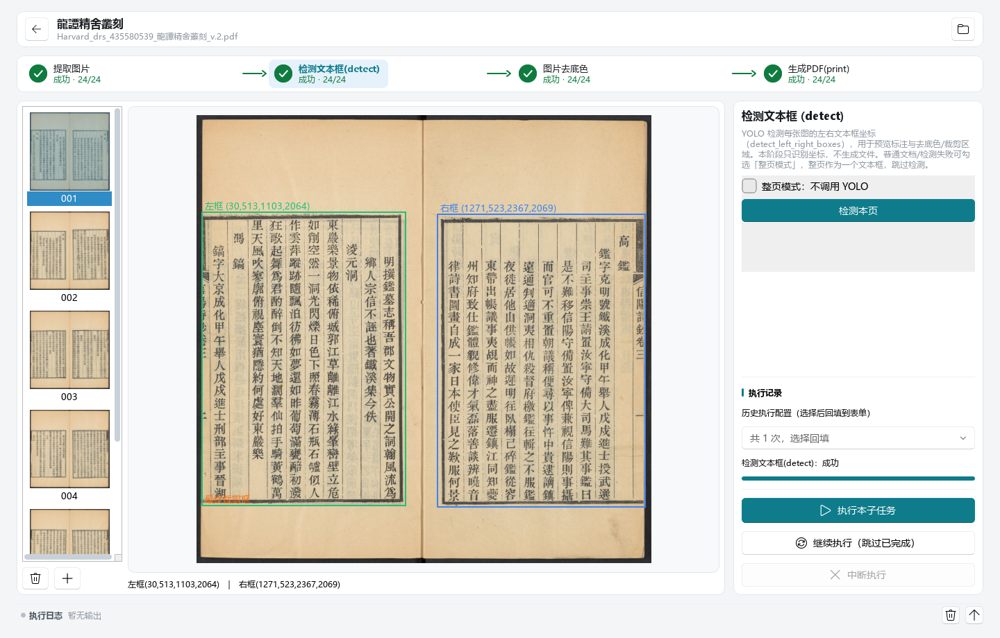

绿色框是左页文本区（画面左侧标「左框」），蓝色框是右页文本区（标「右框」），
框上方标注了坐标。右下角信息条同步显示当前页所有框的坐标。

> 进入本阶段**不会自动检测**（加载模型较慢），需要点右侧 **「检测本页」** 单独检测当前页，
> 或点 **「执行本子任务」** 批量检测全部页。

### 整页模式：不自动识别框

处理的不是双栏古籍（普通 PDF），或这一页怎么都检不出框时，勾右侧
**「整页模式：不调用 YOLO」**：

- 本阶段瞬间完成，也不会生成自动检测框；
- 预览里的框直接**画在页面边界**、跟图片一样大，整页即唯一文本框；
- 框照样能拖动/重画，去底色与打印都按这个框来。

> 整页模式只认**手动框**：此前自动检测留下的旧框不会被沿用，避免「选了整页
> 却还是旧的检测框」。取消勾选即回到正常检测。

### 校正检测框

自动检测难免有偏差，预览区里可以直接改：

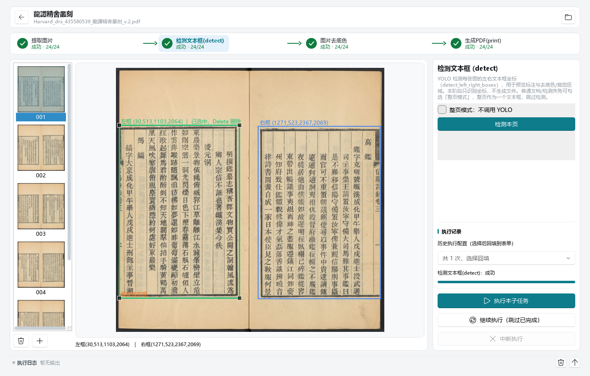

- **拖动**：在框内按住拖动，整体移动；
- **缩放**：点框选中后，拖四角的小方块；
- **删除**：选中后按 `Delete`；
- **手绘补充**：在**空白处**按住拖拽，画出新框。

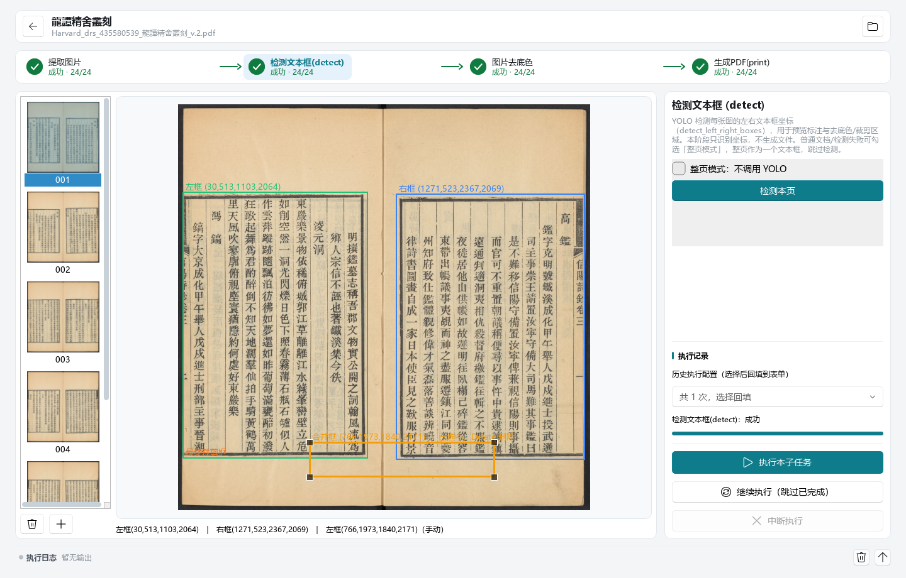

上图在版心下方空白处手绘了第三个框（橙色），信息条末尾会追加一条
「左框(766,1973,1840,2171)（手动）」——**手动框用橙色区分，并带「（手动）」标记**。
它**不会被后续自动检测覆盖**，可以放心调整。

> 大多数情况下**不需要**在这一步手动改框：如果第三、四步的效果已经满意，直接跳过本阶段的
> 手动调整即可。
>
> 如果某一页**一个框都没检出**（如封面、扉页、空白页），那是**正常**的，不是报错——
> 这类页面本来就没有正文需要裁剪，后续步骤会按原样处理。

---

## 4. 第三步：图片去底色（rembg）

把页面底色去掉，得到干净的黑白（或灰度）正文，可选保留红色印章。

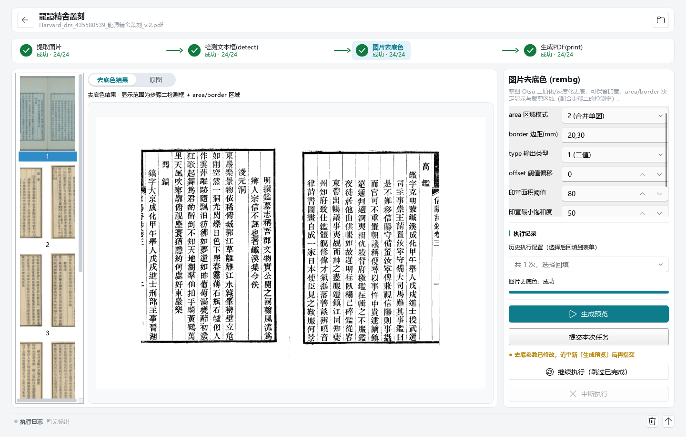

左侧预览默认显示**去底色结果**，顶部可切回**原图**对照。
**area / border 参数在这一步**（不在第二步），它们决定「取哪块区域」：

| 参数            | 说明                                                                                                                                                                                                                                                           |
| --------------- | -------------------------------------------------------------------------------------------------------------------------------------------------------------------------------------------------------------------------------------------------------------- |
| area 区域模式   | `1 (左右分开)`：左右各出一张图，分别处理（**最常用**）<br>`2 (合并单图)`：左右合成一张，保留原页尺寸<br>`3 (整页合并)`：把左右框并成一个大框整页处理<br>`4 (整页/不检测)`：整页即唯一文本框（框画在页面边界，仍可手改），适合普通文档或检测失败时整页去底色 |
| border 边距(mm) | 在框之外多留多少白边（类比 CSS margin）：`30`（四边）／`20,30`（上下,左右）／`20,30,25,35`（上,右,下,左）；留空=裁到框边界                                                                                                                                      |
| type 输出类型   | `1 (二值)` 纯黑白／`2 (1bit)` 体积最小／`3 (灰度)` 保留灰度过渡                                                                                                                                                                                                 |
| offset 阈值偏移 | 正数文字更粗更深，负数更细更淡；一般保持 `0`                                                                                                                                                                                                                    |
| 印章相关        | 勾 **保留印章 (seal)** 启用红色印章识别；**印章彩色 (sealcolor)** 在检出印章时输出彩色 PNG 保留红色                                                                                                                                                             |

### 本阶段是「两段式」，务必按顺序点

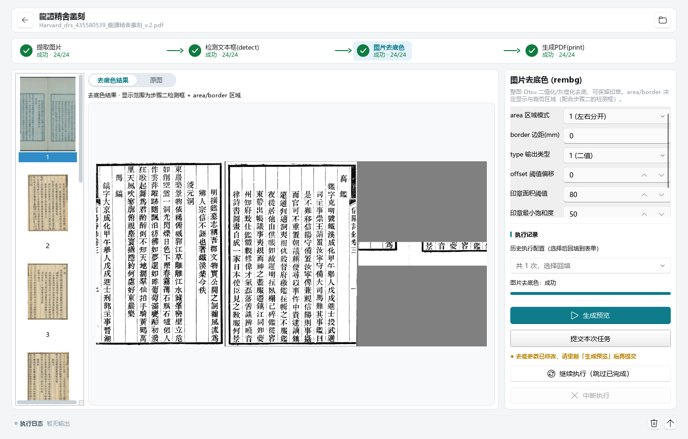

1. 先点 **「生成预览」** —— 按当前参数算出结果供你检查；
2. 确认满意后，再点 **「提交本次任务」** —— 生成正式的去底色图片，供第四步使用。

改了 area / border / type / 印章任意一项后，程序会提示
**「● 去底参数已修改，请重新「生成预览」后再提交」**，此时「提交本次任务」变灰。
这是**有意设计**：避免你用着旧预览却提交了新参数，做出对不上的结果。

选 `area=1` 时左右页各出一张，左侧条目按「右页 / 左页」分开显示，缩略图只显示所属的那半页。

---

## 5. 第四步：生成 PDF（print）

把上一步的去底色图片按你的顺序排好，加上标题、页码，合成最终 PDF。

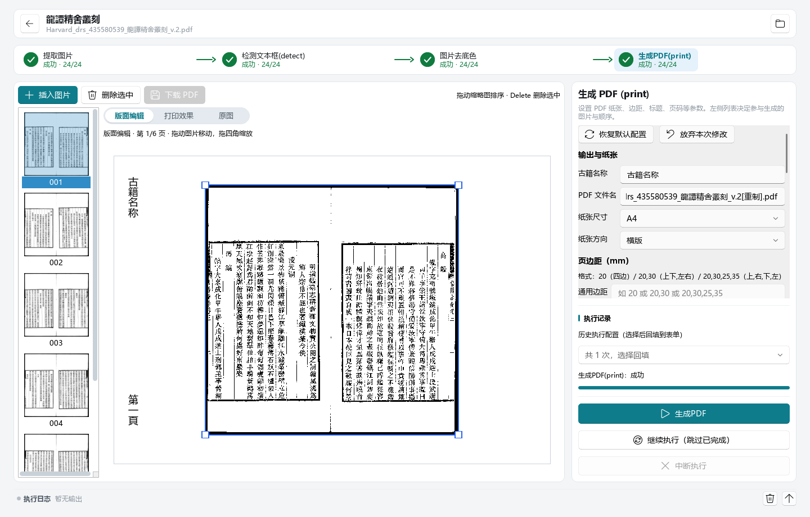

- 左侧是**待打印缩略图条**（与前几步一样）：拖动排序、删除（或按 `Delete`）、
  **「插入图片」** 可引用外部文件。页序就是你看到的顺序，生成的 PDF 严格照此排列。
- 中间是**版面编辑器**：按右侧当前参数算出这一页图片在纸上的位置与大小，
  **直接拖动图片移动、拖四角缩放**，坐标会记进任务、下次进来还在，
  生成 PDF 时严格照此排——所见即所得。没手动改过的页仍走自动排版。
  顶部可切 **「打印效果」**（白纸 + 图片 + 竖排标题/页码的整页效果，只读）
  与 **「原图」**（看图片本身）。
- 拖过之后状态行会显示 **「● 版面已修改，点击「生成 PDF」生效」**，
  点右侧主按钮 **「生成PDF」** 即按当前坐标出成品。
  ⚠️ 「打印效果」**只是预览**——不执行、不提交、也不会生成 PDF；
  要出成品必须点「生成PDF」。参数改一下预览立刻跟着变，
  调边距/字号不必反复生成 PDF 试错。

右侧填参数（分五组）：

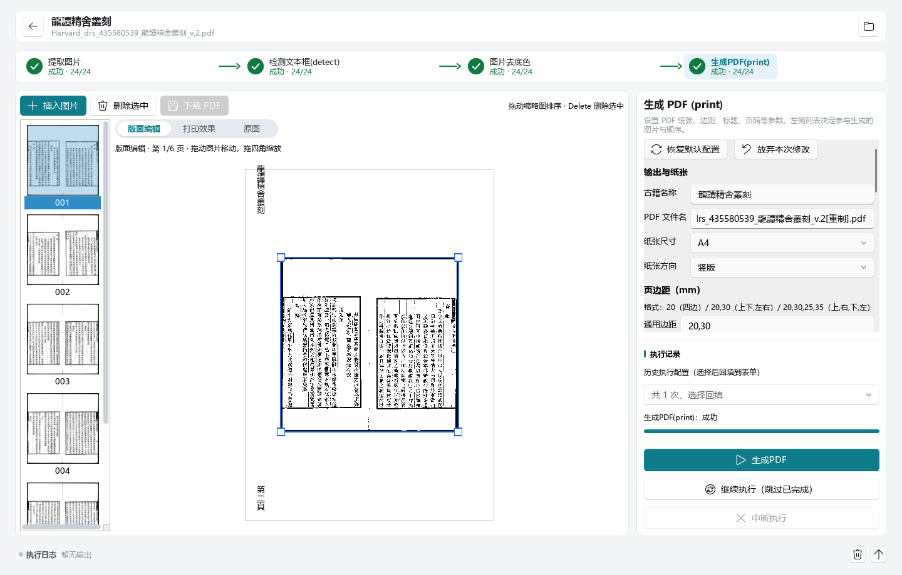

上图是《龍譚精舍叢刻》的实际填法：古籍名称填「龍譚精舍叢刻」后，
**PDF 文件名自动推导**为 `..._龍譚精舍叢刻_v.2[重制].pdf`（取源文件名 + `[重制]`）；
印刷古籍是竖开本，所以纸张方向选了**竖版**。

| 分组       | 关键参数                                                                                           |
| ---------- | -------------------------------------------------------------------------------------------------- |
| 输出与纸张 | **古籍名称**（填了会自动推导 PDF 文件名）、PDF 文件名、纸张尺寸 A4/A3/A5/B5、纸张方向（横版/竖版） |
| 页边距(mm) | 通用边距 + 左/右页边距（左留空=同通用边距）。格式同 border：`20`／`20,30`／`20,30,25,35`           |
| 标题排版   | 勾选**打印标题**后可设字号/颜色、**距页边**；**标题切换节点**用于「按页码切换书名」（如正文换篇）  |
| 页码       | 勾选**打印页码**后可设起始页、页码基准（封面不计数时设 `0`）、**距页边**                           |
| 过滤       | 跳过指定页等                                                                                       |

> 勾 **「预览标注图框与边距」**（在「页边距」组里）可在打印效果预览上用**虚线框**
> 标出图片位置、四边标出边距毫米数，方便核对留白——**只画在预览，不进入成品 PDF**。

> **标题恒在纸张上边、页码恒在下边，而且都是竖排**——界面上不提供这两项的选择
> （古籍定式：书名在版框之上、页码在版心之下）。

> **竖开本古籍记得改「纸张方向」为竖版**——默认是横版，直接用会把竖长的页面
> 挤在横向纸张中间，两侧留大片空白。

### 标题 / 页码「距页边」

标题和页码默认画在**图片外面**的页边区域（不会压到正文）。想精确控制它们
离纸边多远，勾上 **「自定义标题距页边」/「自定义页码距页边」**，
下面就是**两行、每行一个输入框**——不用手写 `上,右,下,左` 那一串数字：

| 行                  | 含义                                                                 |
| ------------------- | -------------------------------------------------------------------- |
| **左右边距**        | 一个值同时管两边：左页贴左纸边、右页贴右纸边，**左右是对称的**       |
| **上边距 / 下边距** | 一个值：**标题填「上边距」**、**页码填「下边距」**（贴着纸的上/下边） |

也就是说：

- **标题**就两行 —— 左右边距 + 上边距（标题**恒贴在纸张上边**），不需要「下边距」；
- **页码**就两行 —— 左右边距 + 下边距（页码**恒贴在纸张下边**），不需要「上边距」；
- 不勾「自定义」= 老样子：标题横向贴页边距中缝、页码贴着纸的下边；
- **图片不会为文字让位**：填了就按你填的距离画，**允许压在图片上**
  （输入框下面那行会实时告诉你距离是多少毫米）；
- 竖排标题里的**英文会自动竖排**：汉字一字一格，英文词整体转 90°
  （`呵呵Happiness` → 呵呵 竖着排，Happiness 转成一个竖条），不用手动换行。

点 **「生成PDF」** 生成 PDF，顶部 **「打开目录」** 可直接跳到任务目录取文件。

> **逐页微调**：想在纸上挪某一页的图片，就在中间**直接拖动**（拖四角缩放）。
> 坐标随该页记在任务里，下次进来还在；改完点「生成PDF」即可。
> 只有你**手动拖过**的页会用记录坐标，其余页跟着纸张/边距参数自动排。

---

## 6. 日志与排查

底部常驻一条**状态条**，显示最近一条输出：

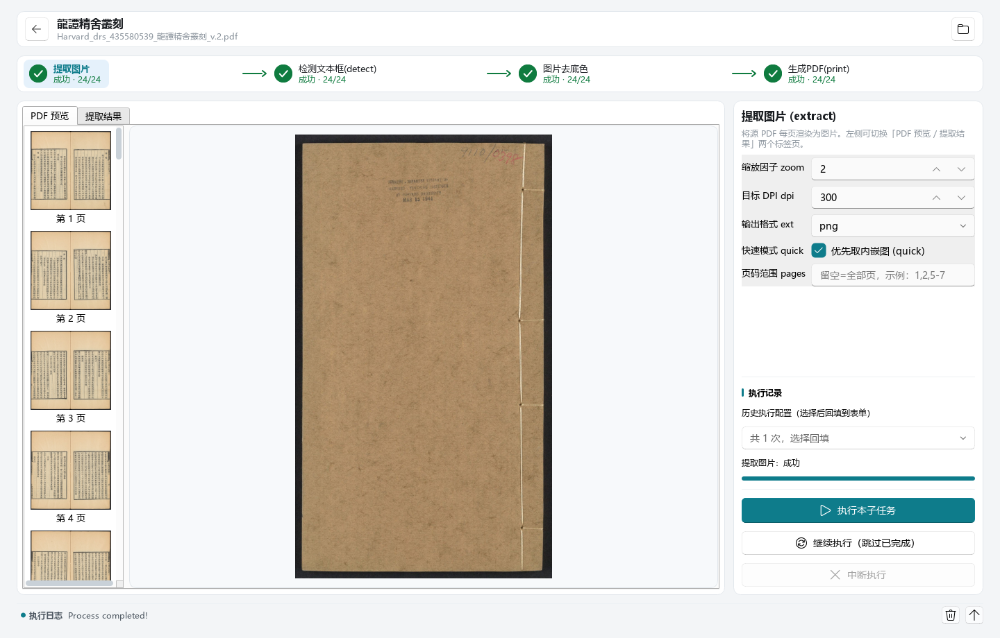

点它展开完整**日志浮层**（也可按右侧「展开」按钮）：

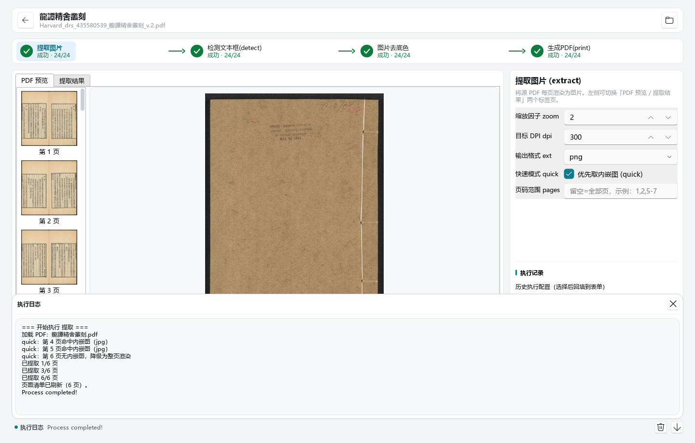

- 执行阶段时自动展开，实时滚动；
- **出错时状态圆点与摘要标红**，日志里能看到完整报错原因；
- 按 `Esc`、点击浮层外、或再点状态条即可收起。

### 常见问题

| 现象                             | 原因与处理                                                                     |
| -------------------------------- | ------------------------------------------------------------------------------ |
| 第二步预览空白 / 没有框          | 本阶段不自动检测。点 **「检测本页」**（单页）或 **「执行本子任务」**（全部页） |
| 第二步某页完全没框               | **正常**：封面、扉页、空白页本就没有正文，检测返回「无框」不算失败             |
| 第三步「提交本次任务」是灰的     | 参数改过还没重新生成预览。先点 **「生成预览」**                                |
| 第三步结果和预览对不上           | 同上，改完参数必须重新生成预览再提交                                           |
| 生成 PDF 后两侧空白很大          | 竖开本古籍忘了把「纸张方向」改成**竖版**（默认横版）                           |
| 提取结果缺页                     | 用 **「继续执行（跳过已完成）」** 补缺失页                                     |
| 某一步失败（胶囊变红）           | 打开日志浮层看红字，常见是源文件被移动/权限不足；修正后重跑该步即可            |
| 手动改的框消失了                 | 手动框（标「手动」）不会被自动结果覆盖；若整页被重新批量检测，请确认改的是当前页 |
| 左侧缩略图一排排发白、像没加载完 | 多半是这一页的页面尺寸记录异常，导致检测框越界裁白；重跑该步的检测后重开任务即可 |
