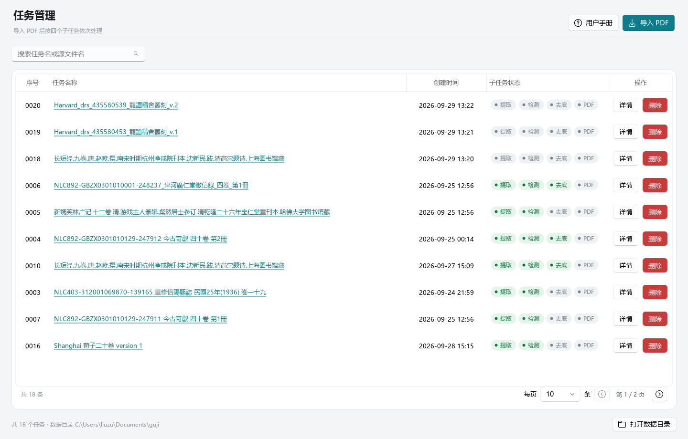
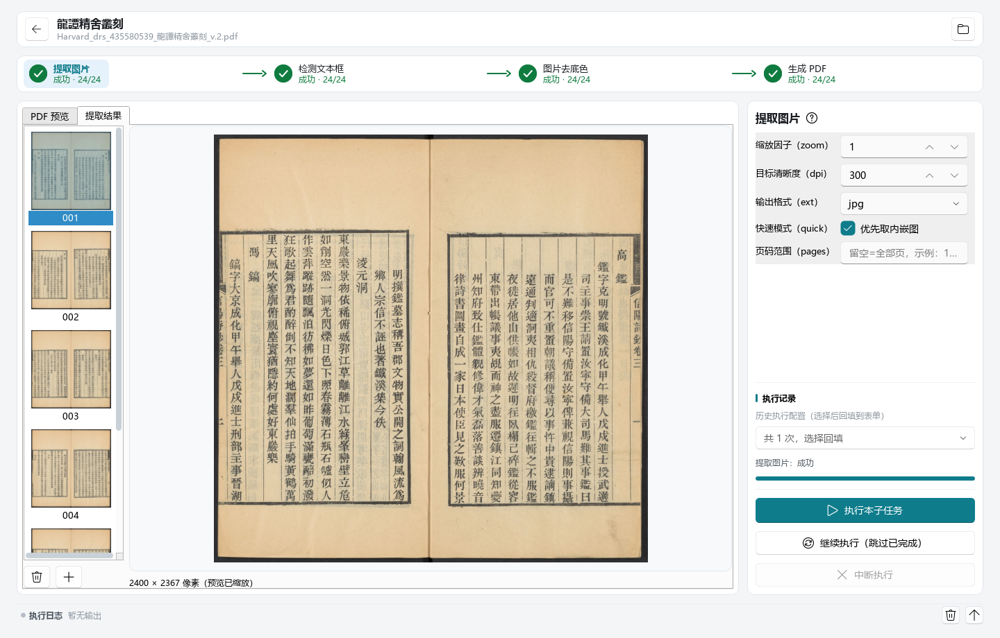
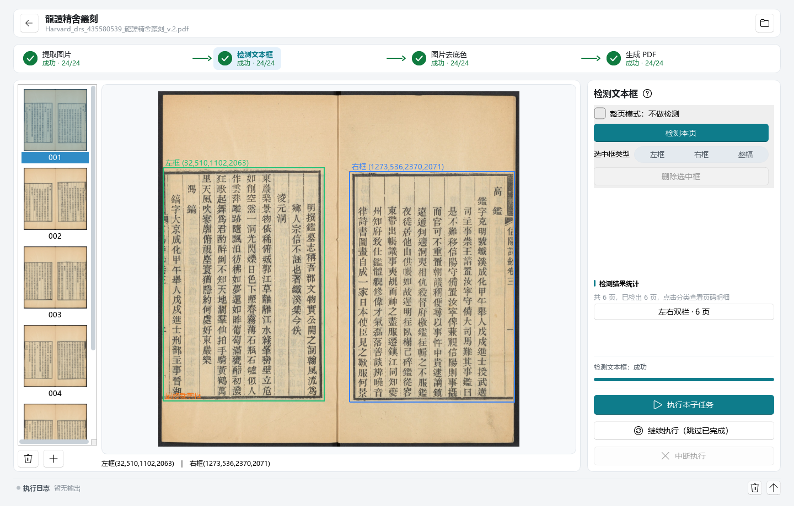
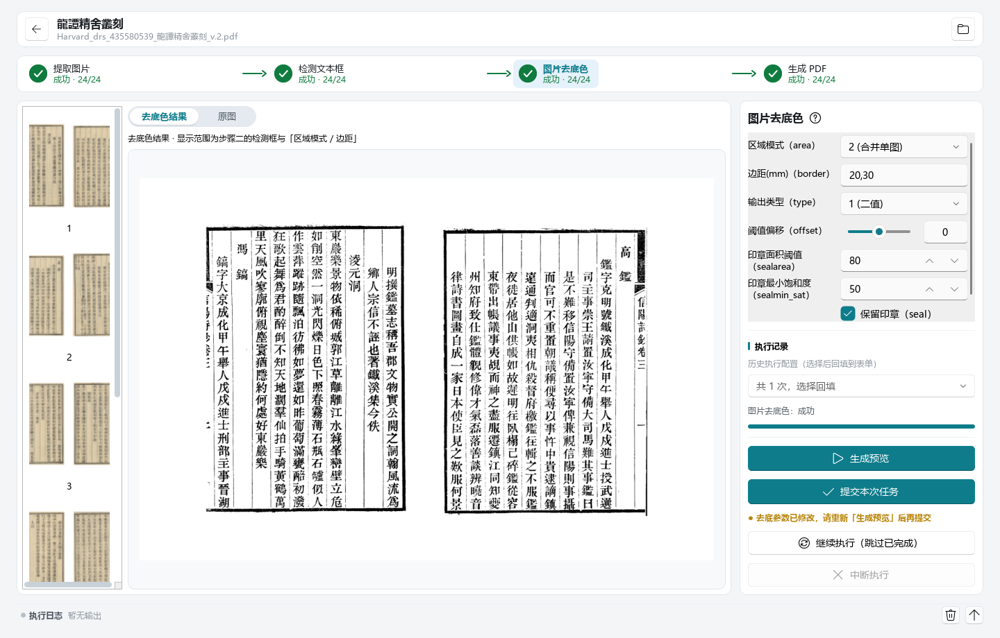
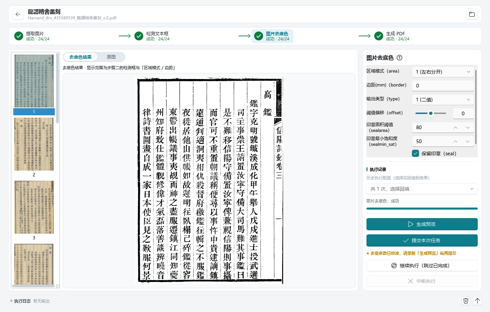
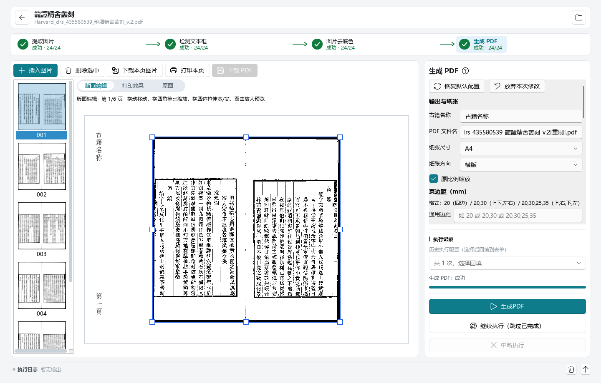
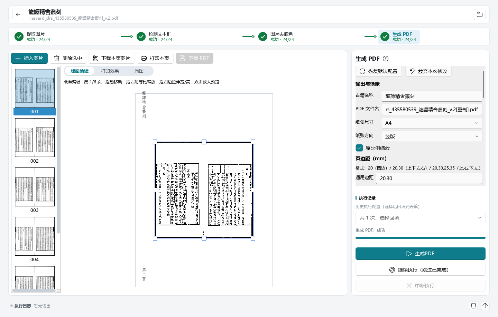
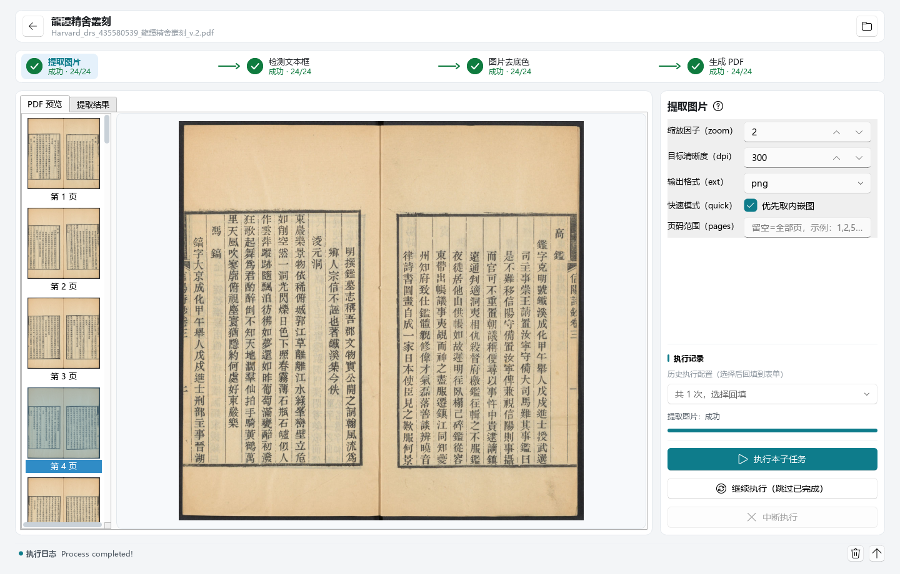
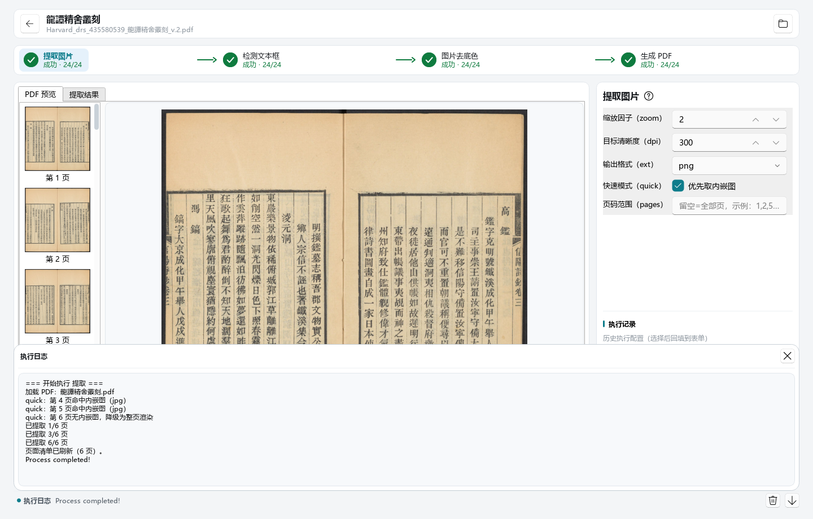

# 用户操作手册：桌面端（从导入到出 PDF）

面向**日常使用者**：不需要懂 Python、命令行或参数语法，照着点即可。

四个步骤固定顺序：**① 提取图片 → ② 检测文本框 → ③ 图片去底色 → ④ PDF排版**。
每一步满意后再进入下一步；中途可以随时中断，之后点「继续执行」只补没做完的部分。

> 第三步的**区域模式确定为「1（左右分开）」**时（在下拉里选过、或执行过），
> 流程条上才会多出一个**可选的虚线节点「图片拼版」**（在去底色与 PDF排版
> 之间，见第 5 节）；全新任务还没配置过去底色时它不出现。不选它（或选了
> 还没有拼版页）时，它的连接线是灰色虚线，「图片去底色 → PDF排版」会在
> 节点上方画一条**横平竖直的直角折线**绕过去（像铺管道）——完全不影响出
> PDF；拼版真正生效后，连线才从节点上走。

> 程序会记住**每个任务上次看到第几步**：下次打开这个任务，直接回到那一步，
> 不用每次重新点回去（还没记录过、或那一步在当前流程里不存在时，就从第一步开始）。

> 本手册截图取自真实操作：以《龍譚精舍叢刻》（63 页、竖开本扫描件）为例，
> 演示页为**第 4 页**（左右两栏都排满的规整正文）。

---

## 0. 启动程序

```powershell
python desktop.py
# 或安装后从开始菜单运行「古籍重製」（可执行文件为 guji-desktop.exe）
```

数据目录默认在 `~/Documents/guji`，里面按任务号（`0001`、`0002`…）分目录存放
全部中间产物。删除任务即删除对应目录，程序不会在别处另存副本。

---

## 1. 创建任务



点右上角 **「创建任务」** 进入创建页，可以先填任务名、再选 PDF：

- **任务名称**：可以不填。
  - 选了 PDF → 留空就用**文件名**（选完会自动填进框里，你可以改）；
  - 没选 PDF → 留空就用默认名 **「任务#0007」** 这种形式，数字就是任务编号。
  - 建完任务后在任务页右上角点铅笔可以随时改名。
- **PDF 源文件**：**可以不选**，「创建任务」按钮随时可点。
  如果当前流程里有「提取图片」这一步（它需要一个 PDF），点「创建任务」时会
  问你一句：现在选一个，还是先不传？两条都行——
  - **现在选择** → 顺手打开选择框，选完就直接把任务建好；
  - **先不传** → 任务照样能建，只是暂时不能执行，**之后在任务页右上角点
    「选择 PDF」随时补上**（页头会写「尚未选择 PDF」提醒你）。

> 进入这种任务时，程序会弹出一层提示（内容区被半透明遮罩盖住、提示卡片居中）——
> **每次进入这个任务都会弹**，不会只弹一次。
> 不想现在处理就点「稍后再说」：右上角那排按钮**始终可用**（提示层不挡它们），
> 随时可以直接点对应的图标去补——提示不会因此消失，你可以接着操作。
> 内容区被遮住期间点不动是正常的，那是提示在提醒你先把输入补上。
> 补上后这些提示会自动消失。

**如果你的流程第一步不是「提取图片」**（比如你把「检测文本框」放在了第一格），
那一步不吃 PDF，它要的是**图片**：程序会改成提醒上传图片，页头高亮的也是
**图片按钮**（相机图标），点它选好的图片会放进本任务的输入目录。你也可以直接
把图片或整个图片文件夹拷进任务目录下的 `stages`目录下的 `input` 子目录 文件夹。
- **选错文件了？** 点文件名右边的 **⊘** 就能清掉重新选（只有选了文件才会
  出现这个按钮）。刚选完时自动填进「任务名称」的文件名也会一起清掉。

选了 PDF 之后，程序在后台计算文件指纹，与已有任务比对：

- **没有重复** → 直接创建任务；
- **有重复** → 弹窗让你选「创建新任务」或「定位已有任务」。选定位会直接跳到已有任务，
  不会重复占用空间。

创建后任务**立刻**出现在列表里（并直接进入该任务的详情页），源文件副本与逐页缩略图由程序在
后台继续处理：页头会显示「正在导入」进度（例如「正在导入 · 缩略图 12/123 · 书名」、后面还排了几个），
处理完自动恢复并提示「导入完成」。这期间可以照常搜索、翻页、双击进任务，也可以继续创建下一本
（后面的文件会自动排队，一次只跑一本）。

> 换了 PDF 等于换了整本书：已有的提取图片、检测框、去底色结果都对应着旧文件，
> 程序会先问一句再清空，让四个步骤重新跑一遍。
> 如果你选的 PDF 内容与某个已有任务**完全相同**，程序会问一句「是否仍然使用」——
> 想在两个任务里各处理一遍就答「仍然使用」；它就是当前这个文件时则什么都不做。

列表中每个任务右侧有 4 个状态胶囊
（提取 / 检测 / 去底 / PDF），**灰色=未执行、蓝色=执行中、绿色=已完成、红色=失败**。

列表最左边的**「序号」就是任务编号**（`0001`、`0002`…），与数据目录里的任务目录一一对应；
排序、搜索、翻页都不会改变它，所以随时可以按号去找磁盘上的任务目录。

点 **「详情」** 进入操作页；**直接点任务名称**（蓝色带下划线的链接）也一样能进。
点 **「删除」** 会连同该任务的全部中间产物一起清理。

> 导入时程序会在任务目录里留一份 PDF 副本，后续所有步骤都用这份副本，
> 原始文件之后被移动或删除也不影响已导入的任务。

---

## 2. 第一步：提取图片

把 PDF 每页渲染成图片，作为后续所有步骤的输入。



左侧预览区有两个标签页：

- **PDF 预览**：看原始文件，用来和提取结果对照；
- **提取结果**：看实际渲染出来的页面，下方缩略图条可**删页 / 插页**。

右侧控制列填参数：


| 参数              | 说明                                    | 建议                                                          |
| ----------------- | --------------------------------------- | ------------------------------------------------------------- |
| 缩放因子（zoom）  | 渲染倍率，越大越清晰、文件越大          | 扫描件一般 `1`；字迹细小时用 `2`                              |
| 目标清晰度（dpi） | 整页渲染的清晰度下限（默认 `300`）      | 一般保持 `300`                                                |
| 输出格式（ext）   | `jpg` 体积小 / `png` 无损               | 黑白古籍用 `jpg` 足够                                         |
| 快速模式（quick） | 优先直接取 PDF 内嵌图（更快、常更清晰） | **保持勾选**；遇到老式压缩格式或内嵌图过小时程序会自动整页渲染 |
| 页码范围（pages） | 留空=全部；示例 `1,2,5-7`               | 先试跑几页确认效果时填                                        |

调好点 **「执行本子任务」**。状态胶囊转绿即完成，底部日志浮层会实时打印每页进度。

> **中断了？** 点 **「继续执行」**（和「中断执行」并排在同一行），只补没提取的页，已完成的不会重做。

---

## 3. 第二步：检测文本框

自动找出每页的**内容框**（双栏排版是左、右两栏；单页排版是整页一个整框），供第三步裁剪和去底色使用（这一步不产生图片文件）。



绿色框是左页文本区（画面左侧标「左框」），蓝色框是右页文本区（标「右框」），
框上方标注了坐标。右下角信息条同步显示当前页所有框的坐标。

> 进入本阶段**不会自动检测**（加载模型较慢），需要点右侧 **「检测本页」** 单独检测当前页，
> 或点 **「执行本子任务」** 批量检测全部页。

### 整页模式：不自动识别框

处理的不是双栏古籍（普通 PDF），或这一页怎么都检不出框时，勾右侧
**「整页模式：不调用 YOLO」**：

- 本阶段瞬间完成，也不会生成自动检测框；
- 预览里的框直接**画在页面边界**、跟图片一样大，整页即唯一文本框；
- 框照样能拖动/重画，去底色与打印都按这个框来。

> 整页模式只认**手动框**：此前自动检测留下的旧框不会被沿用，避免「选了整页
> 却还是旧的检测框」。取消勾选即回到正常检测。

### 检测结果统计：全书页面形态总览

右侧的 **「检测结果统计」** 按**页面形态**给全书分类计数：
**整幅一栏**（整页一个内容区）、**左右双栏**、**左右单栏**（只有一侧有框）、
**无文本框**（封面、扉页、空白页等）。摘要行显示「共 N 页，已检出 M 页」，
页数为 0 的分类不会出现。

- 点某个分类按钮 → 列出该类**每一页的页码**，点页码直接跳到那一页预览；
- 点标题旁的 **「返回」** 按钮回到总览；
- 批量检测、单页检测、手动改框、删页之后统计都会**自动重算**。

批量检测完先看一眼统计，就能知道「这本书多少页是双栏、哪几页没检出框」，
有疑问的页再单独去校正，不必一页页翻。

### 校正检测框

自动检测难免有偏差，预览区里可以直接改：


- **拖动**：在框内按住拖动，整体移动；
- **缩放**：点框选中后，拖四角的小方块；
- **删除**：选中后按 `Delete`，或点右侧 **「删除选中框」**；
- **手绘补充**：在**空白处**按住拖拽，画出新框。

#### 每个框的「类型」：左框 / 右框 / 整幅

选中一个框后，右侧面板的 **「选中框类型」** 会亮出它当前是哪一种，可以随时切换：

| 类型             | 怎么决定                                                                                          |
| ---------------- | ------------------------------------------------------------------------------------------------- |
| **左框 / 右框**  | 由框的**中心位置**决定：这一页有多个框时，按中心从左到右排序，**最靠左的是左框、其余是右框**；只有一个框时，看它的中心在中线的左边还是右边。**拖动或缩放后随时重判**——框的相对位置变了，左右身份会自动互换 |
| **整幅**         | 整页只有一个内容区时用。**显式选择**——选过之后无论怎么拖动、缩放都还是整幅，不会被位置改判        |

一页只有两种形态，两者**互斥**：

- **半幅**：左边一个框、右边一个框（**最多两个**，允许只检出一侧）；
- **整幅**：整页只有一个框（检测模型判为「整幅」的页面）。

所以把某个框设成「整幅」时，如果这一页还有别的框，会弹确认框问是否删除它们；
没有选中框时点类型按钮，则是「选中这一页里该类型的框」。

> 删掉其中一个框，**不会影响其他框的类型**（比如删掉左框，剩下的仍然是右框，
> 不会变成整幅）。
>
> 半幅页最多左右两个文本框、整幅页只有一个；超出时会在图上给出提示，
> 先删除多余的框或改类型再画。


上图在版心下方空白处手绘了补充框，信息条末尾会追加一条带「（手动）」的说明
——**手动框带「（手动）」标记**。它**不会被后续自动检测覆盖**，可以放心调整
（新框画在已有左框的右侧，所以按位置自动判为右框）。

> 大多数情况下**不需要**在这一步手动改框：如果第三、四步的效果已经满意，直接跳过本阶段的
> 手动调整即可。
>
> 如果某一页**一个框都没检出**（如封面、扉页、空白页），那是**正常**的，不是报错——
> 这类页面本来就没有正文需要裁剪，后续步骤会按原样处理。

---

## 4. 第三步：图片去底色

把页面底色去掉，得到干净的黑白（或灰度）正文，可选保留红色印章。



左侧预览默认显示**去底色结果**，顶部可切回**原图**对照。
**「区域模式 / 边距」参数在这一步**（不在第二步），它们决定「取哪块区域」：

| 参数               | 说明                                                                                                                                                                                                                                                           |
| ------------------ | -------------------------------------------------------------------------------------------------------------------------------------------------------------------------------------------------------------------------------------------------------------- |
| 区域模式（area）   | `1 (左右分开)`：左右各出一张图，分别处理（**最常用**）<br>`2 (合并单图)`：左右合成一张，保留原页尺寸<br>`3 (整页合并)`：把左右框并成一个大框整页处理<br>`4 (整页/不检测)`：整页即唯一文本框（框画在页面边界，仍可手改），适合普通文档或检测失败时整页去底色<br>**整页只有一个内容区的页面**（识别为「整幅」的页面）四种模式结果一样，都按整页输出 |
| 边距(mm)（border） | 在框之外多留多少白边（类似页边距）：`30`（四边）／`20,30`（上下,左右）／`20,30,25,35`（上,右,下,左）；留空=裁到框边界                                                                                                                                      |
| 输出类型（type）   | `1 (二值)` 纯黑白／`2 (1bit)` 体积最小／`3 (灰度)` 保留灰度过渡                                                                                                                                                                                                 |
| 阈值偏移（offset） | 正数文字更粗更深，负数更细更淡；一般保持 `0`                                                                                                                                                                                                                    |
| 印章相关           | 勾 **保留印章（seal）** 启用红色印章识别；**印章彩色（sealcolor）** 在检出印章时输出彩色 PNG 保留红色                                                                                                                                                             |

### 本阶段是「两段式」，务必按顺序点



1. 先点 **「生成预览」** —— 按当前参数算出结果供你检查；
2. 确认满意后，再点 **「提交本次任务」** —— 生成正式的去底色图片，供第四步使用。

改了 area / border / type / 印章任意一项后，程序会提示
**「● 去底参数已修改，请重新「生成预览」后再提交」**，此时「提交本次任务」变灰。
这是**有意设计**：避免你用着旧预览却提交了新参数，做出对不上的结果。

选 `area=1` 时左右页各出一张，左侧条目按「右页 / 左页」分开显示，缩略图只显示所属的那半页。

---

## 5. 图片拼版（可选节点）

**只在第三步把「区域模式」设为 `1（左右分开）` 时**，流程条上才会在
「图片去底色」与「PDF排版」之间出现一个**可选节点「图片拼版」**——
**未选择时是虚线框**，选择后变成实线主题色；其余步骤都是实线框。
它是**可选**的：不选就照旧用第三步的去底色图片出 PDF。

拼版把两张成品图并排合成一页——**序号在前的排在右侧、序号大的排在左侧**
（贴合古籍从右往左的阅读顺序）。
**不需要设纸张**：中间就是一块白底，图怎么摆、摆多大都由你定；
生成时按**两张图的实际范围**合成一张图（图挪到哪、拉到多大，产出就跟到哪）。

### 怎么拼

1. 点流程条上的虚线节点 **「图片拼版」**，进入拼版页面；
2. 左侧一列是 **「第一页」「第二页」…**，最后一格是虚线的 **「＋ 选择拼版」**。
   点它会弹出挑选窗口；
3. 窗口里以**卡片网格**排出**还没被任何一页拼版用过**的图片（来源是第三步
   **「提交本次任务」** 的成品图），每张卡片是「缩略图 + 文件名」。
   **点整张卡片即可勾选**（左上角出现对勾、卡片变浅色底）。
   勾选**两张**后点「确定」——序号在前的那张自动排到右边；
4. 右侧操作区可以调版面：
   - **点击某张图 → 选中它**：被选中的图带一圈**常显的细虚线**（选中状态）；
     点空白处或翻页就取消选中；
   - **拖动**图 → 移动位置；
   - 拖**四角**缩放（按住 `Shift` 等比）、拖**四条边**单独拉伸；
   - 拖图上方的**圆钮** → 旋转（按住 `Shift` 吸附到 15°）；
   - **双击某张图** → 弹窗预览这张原图；**双击两图之外的空白处** → 弹窗
     预览整页左右组合（即灰色虚线框范围的成品效果）；
   - **右键某张图或空白处** → 菜单里选 **「预览图片」**（与双击相同）或
     **「编辑图片」**（不经过预览弹窗，直接进图片编辑器）：编辑单张图会
     **覆盖回源图**（拼版成品随后自动重新合成）；编辑空白处的整页组合
     则把修改**覆盖到本页拼版成品**——注意之后再调整该页版面会重新合成、
     覆盖这次编辑；
   - 右侧面板分成两块：**「操作当前图片页」**（页级：**「整体旋转」**
     度数框 + 通栏滑块（滑块 0.01° 一格，适合微调；大角度直接在框里输入，
     两张图绕公共中心一起转）、**「复位本页版面」**
     与**「删除本页拼版」**（同一行两个按钮）、清空）和
     **「操作当前图片」**（图片级：旋转，只转选中的
     那张——**这块只在画布里选中了某张图时高亮可用**，翻页或取消选中后
     自动置灰）；面板标题旁的**问号按钮**里有本步说明。
   > 画面上有一条**恒显的红色垂直虚线**，穿过左右两张图中心的**中点**——
   > 旋转时拿它当对比基准：整版怎么转，这条中线都不动。
   > 另有一圈**恒显的灰色虚线框**，是两张图（旋转后）**最外侧点组成的外接
   > 框**——它就是**成品截图的范围**：转一转/挪一挪，框跟着变，框里有什么
   > PDF 里就是什么。
   > 选中的图平时带一圈**细虚线**；**按住鼠标操作时**才升级为**带手柄的
   > 虚线框**，一松手回到细框。鼠标移到四角/四边/圆钮附近时
   > **光标会变**，照着光标拖就行。
5. 翻页用**画布下方右侧**的**「上一页」「下一页」**；在左侧列表里
   **按住某一页上下拖**可以调页序（顺序就是最终 PDF 的页序），
   **「删除本页拼版」** 删掉一页（会先**弹窗确认**——版面调整会丢失）；
6. 要一次删掉多页：**勾选左侧每格左上角的勾选框**选中多页——清单下沿会
   浮出操作条（显示**「已选 N 页」**），点其中的**「批量删除」**
   （点错可点**「取消选择」**全部重来）——同样会先**弹窗确认**，
   被删页的图片释放回未选择列表，源图不受影响。

### 生效与不生效

- 面板**底部**的 **「在流程中启用图片拼版」** 勾上 → **拼版启用**：第四步的
  待打印列表与 **「生成PDF」** 改用拼版结果；不勾选则用第三步的去底色图片。
- 勾上但**一页都还没拼**时，流程也已经切到拼版了——此时第四步列表是空的，
  状态行会提示「拼版已启用，但还没有拼版页」。先点 **「＋ 选择拼版」**
  拼出至少一页，再点「生成PDF」。
- 拼版页全部删光（清空）也仍算**启用**，第四步同样提示去拼版；想改回去底色
  图片请**取消勾选**这个开关。

> 拼出第一页时程序会**自动帮你勾上**这个开关；想回到去底色图片，
> 取消勾选即可——拼版版面不会被删掉，随时可以再勾回来。

**改了开关之后，之前生成的 PDF 不再算数**：换过取图来源之后，
第四步的「下载 PDF」会变成不可点，状态行提示「取图来源已改为拼板，
请重新「生成PDF」」——因为磁盘上那份是用**上一轮来源**（去底色图）
排出来的，点一下「生成PDF」就会用拼版结果重出一份。

回到任务列表也能一眼看出差别：启用了拼版的任务，「子任务状态」里会
多出一个 **「拼版」** 胶囊（排在「PDF」前面）；已经拼好页的显示绿色，
还没拼页的显示灰色。未启用的任务仍是四个胶囊。

版面改完不用另外点"保存"：切页、切步骤、关窗口都不会丢；
点 **「生成PDF」** 时程序会先把拼版页重新合成一遍，
保证 PDF 用的就是你现在看到的版面。

---

## 6. 第四步：PDF排版

把上一步的去底色图片按你的顺序排好，加上标题、页码，合成最终 PDF。



- 左侧是**待打印缩略图条**（与前几步一样）：拖动排序、删除（或按 `Delete`）、
  **「插入图片」** 可引用外部文件。页序就是你看到的顺序，生成的 PDF 严格照此排列。
- 中间是**版面编辑器**：按右侧当前参数算出这一页图片在纸上的位置与大小，
  **直接拖动图片移动、拖四角缩放**，坐标会记进任务、下次进来还在，
  出 PDF 时严格照此排——所见即所得。没手动改过的页仍走自动排版。
  顶部可切 **「打印效果」**（白纸 + 图片 + 竖排标题/页码的整页效果，只读）
  与 **「原图」**（看图片本身）。
- **原比例缩放**（默认勾选）：**四角拖拽**保持原始宽高比，不会把字拉变形。
  版面编辑器的**上/下/左/右四个边手柄始终可用**——单独拖某条边就能把图片
  压扁或拉长（宽高自由调整，比例随之改变）；不想改比例就只拖四角。
  **取消勾选**后：没手动调过的页会**铺满**可用区域（受页边距约束），
  四角拖拽也变为自由拉伸。
- 拖过之后状态行会显示 **「● 版面已修改，点击「生成PDF」生效」**，
  点右侧主按钮 **「生成PDF」** 即按当前坐标出成品。
  ⚠️ 「打印效果」**只是预览**——不执行、不提交、也不会出 PDF；
  要出成品必须点「生成PDF」。参数改一下预览立刻跟着变，
  调边距/字号不必反复出 PDF 试错。

### 只想导出其中一页的图片

不必出整本 PDF、只要**某一页排好版的样子**时，用工具栏的
**「下载本页图片」**（在「下载 PDF」左边）：

- 导出的是**当前选中页**在纸上的最终效果（含标题、页码、边距，与 PDF 里那一页
  一致），**只导这一页**，不出 PDF；
- 精度与 PDF **同级**（300dpi）：A4 横向约 3508×2480 像素，可直接打印或转给别人；
  与屏幕上看到的缩放比例无关；
- 保存对话框里可选 **PNG**（默认，无损）或 **JPEG**；
- 原图本身分辨率不够 300dpi 时，按原图能给到的最高精度导出——**不会**凭空放大。

⚠️ 分清两个按钮：「下载 PDF」是**整本成品**；「下载本页图片」只出**当前这一页**。

右侧填参数（分五组）：



上图是《龍譚精舍叢刻》的实际填法：古籍名称填「龍譚精舍叢刻」后，
**PDF 文件名自动推导**为 `..._龍譚精舍叢刻_v.2[重制].pdf`（取源文件名 + `[重制]`）；
印刷古籍是竖开本，所以纸张方向选了**竖版**。

| 分组       | 关键参数                                                                                           |
| ---------- | -------------------------------------------------------------------------------------------------- |
| 输出与纸张 | **古籍名称**（填了会自动推导 PDF 文件名）、PDF 文件名、纸张尺寸 A4/A3/A5/B5、纸张方向（横版/竖版）、**原比例缩放**（勾选，默认开） |
| 页边距(mm) | 通用边距 + 左/右页边距（左留空=同通用边距）。格式同 border：`20`／`20,30`／`20,30,25,35`           |
| 标题排版   | 勾选**打印标题**后可设**字体**、字号/颜色、**距页边**；**标题切换节点**用于「按页码切换书名」（如正文换篇） |
| 页码       | 勾选**打印页码**后可设起始页、页码基准（封面不计数时设 `0`）、**样式与前后缀**、**字体**、**距页边** |
| 过滤       | 跳过指定页等                                                                                       |

### 标题 / 页码的字体

标题和页码各有**一个独立的字体下拉**，默认都是 **「自动（仿宋优先）」**：
系统里有仿宋就用仿宋，没有则依次降级到宋体、微软雅黑、黑体、其它中文字体。
想让书名和页码用不同字体（例如书名仿宋、页码黑体），分别选即可。

> **生僻字、异体字不会画成空白。** 古籍里常有不常用的字，而**任何单一字体**
> 都不可能覆盖全部汉字（仿宋就没有「扩展 B」区的字）。程序在排版时会**逐字**
> 检查：当前字体没有这个字，就自动用系统里其它字体把它补上——常用字仍然是你
> 选的那个字体，只有真正缺的那个字才换字体。所以这里只需挑**风格**，不用
> 担心个别字排不出来。

### 页码样式与前后缀

默认排 **「第一頁」**（中文数字 + 前后缀）。想换样式：

| 项目     | 说明                                                                 |
| -------- | -------------------------------------------------------------------- |
| 页码样式 | **中文数字**（五）／**阿拉伯数字**（5）／**干支**（甲子，按六十甲子循环） |
| 前缀     | 数字前面加什么字，默认「第」                                         |
| 后缀     | 数字后面加什么字，默认「頁」                                         |

前后缀是**原样拼接**的，程序不补空格：想排「第 5 页」就把前缀写成 `第 `、
后缀写成 ` 页`。两个都留空则只印数字本身。

> **标题恒在纸张上边、页码恒在下边，而且都是竖排**——界面上不提供这两项的选择
> （古籍定式：书名在版框之上、页码在版心之下）。

> **竖开本古籍记得改「纸张方向」为竖版**——默认是横版，直接用会把竖长的页面
> 挤在横向纸张中间，两侧留大片空白。

### 标题 / 页码「距页边」

标题和页码默认画在**图片外面**的页边区域（不会压到正文）。想精确控制它们
离纸边多远，勾上 **「自定义标题距页边」/「自定义页码距页边」**，
下面就是**两行、每行一个输入框**——不用手写 `上,右,下,左` 那一串数字：

| 行                  | 含义                                                                 |
| ------------------- | -------------------------------------------------------------------- |
| **左右边距**        | 一个值同时管两边：左页贴左纸边、右页贴右纸边，**左右是对称的**       |
| **上边距 / 下边距** | 一个值：**标题填「上边距」**、**页码填「下边距」**（贴着纸的上/下边） |

也就是说：

- **标题**就两行 —— 左右边距 + 上边距（标题**恒贴在纸张上边**），不需要「下边距」；
- **页码**就两行 —— 左右边距 + 下边距（页码**恒贴在纸张下边**），不需要「上边距」；
- 不勾「自定义」= 老样子：标题横向贴页边距中缝、页码贴着纸的下边；
- **图片不会为文字让位**：填了就按你填的距离画，**允许压在图片上**
  （输入框下面那行会实时告诉你距离是多少毫米）；
- 竖排标题里的**英文会自动竖排**：汉字一字一格，英文词整体转 90°
  （`呵呵Happiness` → 呵呵 竖着排，Happiness 转成一个竖条），不用手动换行。

点 **「生成PDF」** 出成品 PDF，顶部 **「打开目录」** 可直接跳到任务目录取文件。

> **逐页微调**：想在纸上挪某一页的图片，就在中间**直接拖动**（拖四角缩放）。
> 坐标随该页记在任务里，下次进来还在；改完点「生成PDF」即可。
> 只有你**手动拖过**的页会用记录坐标，其余页跟着纸张/边距参数自动排。

---

## 7. 图片预览：双击图面看清细节

预览区显示的始终是**整页缩略**——一张两三千像素高的页面塞进几百像素高的面板里，
字迹看着发虚是正常的（屏幕就那么大）。要看细节不用眯眼：

**在预览图上双击**，会弹出独立的图片预览窗口。

- **滚轮**：以光标所在位置为中心放大 / 缩小；
- **按住左键拖动**：平移画面。**没缩放也能拖**——图片放在窗口里也能挪位置；
- **双击画面**：在「适应窗口」与「100%」之间切换；
- 工具条：`缩小` `放大` `适应窗口` `100%` `左旋` `右旋`
  `水平翻转` `垂直翻转` `下载`；
- 快捷键：`←` `→` 上一页 / 下一页，`+` `-` 缩放，`0` 适应窗口，`1` 原始比例，
  `R` 旋转，`Esc` 关闭。

几个要点：

- 弹窗会按窗口大小**现渲染**一版更高分辨率的图（不是把预览区里的小图放大）。
  缩放到 **100%** 时，图片的一个像素正好对应屏幕的一个像素——这是当前窗口下
  最清楚的显示比例，**想看清哪一处，就放到 100% 再把那一块拖到中间**；
- 超过 100%（如 200%、400%）属于「把图放开看」：屏幕像素总数没变，会逐渐发虚，
  这是屏幕的物理上限，不是程序在偷工减料；
- 「翻转 / 旋转」只影响**显示与下载**，不改动磁盘上的原图——关掉重开即复位；
- 「下载」按**整分辨率**另存（与屏幕上的缩放比例无关），可选 PNG（无损）
  或 JPEG（有损，画质 90）；
- 四个步骤的预览都能双击放大；第四步的「打印效果」在弹窗里是**按目标尺寸
  重新排版**的，标题与页码同样清晰。

### 右键：预览图片 / 编辑图片（各步骤通用）

**每个步骤的预览区**（第一 ~ 第四步，以及「图片拼版」画布）都能**右键图片**，
弹出菜单：

- **预览图片**：与双击效果相同，打开图片预览弹窗；
- **编辑图片**：**不经过预览弹窗**，直接打开图片编辑器（裁剪 / 变换 / 变形 /
  擦除 / 插入文字）。「完成」= 把编辑结果**覆盖回这张图对应的真实文件**——
  所以编辑不是"本步骤看看"，而是会顺着流程**传到后面的步骤、最终进 PDF**。

改的是哪个文件，取决于你**当前显示的是处理前还是处理后的图**：

| 你看到的 | 「编辑图片」改的是 | 什么时候生效到下一步 |
| --- | --- | --- |
| 第一 / 第二步的页面图 | 提取出来的那张页面图 | 第二步检测、后续都读它（改了尺寸建议**重跑检测**） |
| 第三步「原图」 | 提取出来的页面图 | 同上 |
| 第三步「去底色结果」 | 该页的去底色**结果文件** | 点 **「提交本次任务」** 后，第四步才用上 |
| 第四步「原图 / 版面编辑 / 打印效果」 | 待打印的那张图 | 点 **「生成PDF」** 即用上 |
| 拼版：右键某张图 | 该图**源文件** | 拼版成品自动重新合成 |
| 拼版：右键空白处 | 本页拼版**成品** | 出 PDF 即用上（之后再调该页版面会重新合成、覆盖这次编辑） |

> ⚠️ 第三步改过参数后出现的**「实时预览」是临时图**（还没点「生成预览」），
> 这种状态下不提供「编辑图片」——改了会被下一次实时预览覆盖、也不会进提交
> 产物。想编辑就先点「生成预览」。
>
> ⚠️ 第一步左侧的 **「PDF 预览」** 标签页是源 PDF，没有可回写的图片文件，
> 右键只提供「预览图片」。

### 独立功能页：同样能预览与编辑

左侧导航里除了「任务流程」，还有**不用建任务**的独立功能页（图片提取 / 检测文本框 /
去底色 / PDF排版 / 图片拼版）。它们的预览区规则与上面**完全一致**：双击放大、
右键「预览图片 / 编辑图片」，「完成」= 覆盖回那张真实文件；编辑后左栏的**大图与
缩略图都会立刻换成编辑后的样子**（缩略图是后台重渲的，稍等一下）。

改的是哪个文件、什么时候生效，按页面不同：

| 页面 | 你看到的 | 「编辑图片」改的是 | 什么时候生效 |
| --- | --- | --- | --- |
| 图片提取 | 未提取时的 PDF 页 | —（矢量页，只提供「预览图片」） | — |
| 图片提取 | 提取出来的图片 | 那张提取结果图 | 检测 / 去底色读的就是它 |
| 检测文本框 | 待检测的图片 | 那张图片本身 | 框坐标以图片原始像素为基准，改过尺寸请**重新执行检测**再导出 |
| 去底色 | 「原图」 | 那张源图 | 点「执行」重跑一次才用上 |
| 去底色 | 「去底色结果」 | 该结果文件 | 合成为 PDF 时用的就是它 |
| PDF排版 | 待打印的图 | 那张待打印图 | 点「生成PDF」即用上 |
| PDF排版 | 已生成的 PDF 页 | —（矢量页，只提供「预览图片」） | — |
| 图片拼版 | 双击 / 右键某张图 | 该图**源文件** | 点「导出成品」即用上 |
| 图片拼版 | 双击 / 右键两图之外 | 本页整页组合（成品口径） | 导出时用编辑后的图（**之后再调该页版面会重新合成、覆盖这次编辑**） |

> 「图片拼版」的整页组合是**虚拟合成图**（还没有落盘成品），所以它的编辑结果
> 先存在独立任务缓存区里，导出那一刻盖到对应成品上——这也是为什么它同样是
> 「点导出才生效」。

---

## 8. 独立任务页：不用建任务，选了就能跑

左侧导航除了「任务流程」，还有五个**独立任务页**（把流程里的一步单独拆出来用）：
**PDF图片提取 / 检测文本框 / 图片去底色 / PDF排版 / 图片拼板**。

适合的场景：临时处理一两张图、一个小册子，不想创建任务、也不想走完整四步。

### 通用操作

每个独立页的用法都是同一套「三拍」：

1. **给输入**：刚进页面只有一个大输入区——把文件/文件夹**拖进来**，或点它用
   选择对话框挑（接受目录的页面会有「选择文件夹」按钮）；
2. **调参数、看预览**：给了有效输入后，右栏参数面板和左侧预览区才会展开
   （参数面板与任务流程里同名步骤的**完全相同**）；
3. **点执行**：执行按钮上方有进度条（条 + 计数同行），底部日志区实时滚动。
   产物输出在**输出目录**——默认自动填好，就在源文件旁边：

   | 页面 | 默认输出位置 |
   | --- | --- |
   | PDF图片提取 | `<PDF 名>_提取/` |
   | 检测文本框 | `<源目录或图名>_检测/` |
   | 图片去底色 | `<源目录或图名>_去底/` |
   | PDF排版 | `<源目录或图名>_成书/<书名>.pdf` |
   | 图片拼板 | 源旁「拼图」目录（点「导出成品」时写） |

   输出目录框**可以改**；改参数后重新点执行即可覆盖。

> 独立页的预览、双击放大、右键「预览图片 / 编辑图片」规则与任务流程完全一致，
> 各页面「编辑图片」改的是哪个文件、何时生效，见第 7 节末尾的「独立功能页」表。

### 各页特有的出口

- **检测文本框**：除了检测，右栏还有两个导出按钮——
  「**导出标注图**」（把框画回原图存 PNG，肉眼核对框准不准）和
  「**导出坐标 JSON**」（把框坐标存成JSON，格式与任务流程里检测那步导出的
  完全一致，可以直接互相替换）。预览里可以拖拽 / 缩放 / 删除 / 手绘修正框再导出。
- **PDF排版**：直接把图片目录合成 PDF（`artifact` 是**一个文件**，不是目录）；
  参数与任务流程第四步相同（纸张、标题、页码……）。
- **图片拼板**：拖入一批图片后，用「**自动拼版**」按文件名规则配对（前一页左半幅
  + 当前页右半幅），或手动「＋ 选择拼版」配两张图；摆好后点「**导出成品**」。
  注意：独立页**没有**「在流程中启用图片拼版」开关——那是任务流程里决定第四步
  取图来源的概念，独立页导出即成品。

### 与任务流程的关系

- **数据不相通**：独立页不读写任何任务目录，任务流程也看不到独立页的产物；
  两边只有界面组件和参数面板是共用的。
- 想把独立页的成果接进某个任务继续处理：记住输出目录，在任务流程对应步骤里
  手动指定它（或直接用命令行 `guji` 对该目录继续跑下一步）。
- 独立页的参数**不跨会话记忆**，每次打开都是默认值（任务流程才按任务记住历史参数）。

---

## 9. 日志与排查

底部常驻一条**状态条**，显示最近一条输出：



点它展开完整**日志浮层**（也可按右侧「展开」按钮）：



- 执行阶段时自动展开，实时滚动；
- **出错时状态圆点与摘要标红**，日志里能看到完整报错原因；
- 按 `Esc`、点击浮层外、或再点状态条即可收起。

### 常见问题

| 现象                             | 原因与处理                                                                     |
| -------------------------------- | ------------------------------------------------------------------------------ |
| 第二步预览空白 / 没有框          | 本阶段不自动检测。点 **「检测本页」**（单页）或 **「执行本子任务」**（全部页） |
| 第二步某页完全没框               | **正常**：封面、扉页、空白页本就没有正文，检测返回「无框」不算失败             |
| 第三步「提交本次任务」是灰的     | 参数改过还没重新生成预览。先点 **「生成预览」**                                |
| 第三步结果和预览对不上           | 同上，改完参数必须重新生成预览再提交                                           |
| 出 PDF 后两侧空白很大          | 竖开本古籍忘了把「纸张方向」改成**竖版**（默认横版）                           |
| 提取结果缺页                     | 用 **「继续执行」** 补缺失页                                                   |
| 某一步失败（胶囊变红）           | 打开日志浮层看红字，常见是源文件被移动/权限不足；修正后重跑该步即可            |
| 手动改的框消失了                 | 手动框（标「手动」）不会被自动结果覆盖；若整页被重新批量检测，请确认改的是当前页 |
| 画不出新框、提示「框数已达上限」 | 半幅页最多左右两个框、整幅页只有一个。先删掉多余的框，或把「整幅」改成左框/右框再画 |
| 点「左框/右框」没反应            | 左框/右框由框的**中心位置**自动判定（多个框时最靠左的是左框）：把框挪得比另一个框更靠左或更靠右，身份就会互换（整幅才是手动选的类型） |
| 左侧缩略图一排排发白、像没加载完 | 多半是这一页的页面尺寸记录异常，导致检测框越界裁白；重跑该步的检测后重开任务即可 |
| 流程条上没有「图片拼版」节点   | 只有第三步「区域模式 = 1（左右分开）」时它才出现；改成 `1` 即可        |
| 拼好了但 PDF 里还是去底色的图  | 拼版面板上的 **「在流程中启用图片拼版」** 没勾（或一页拼版都没加）；勾上再点「生成PDF」 |
| 「下载 PDF」点不动、状态行说"取图来源已改" | 取图来源换了（拼版开关变了），之前那份 PDF 是旧来源排出来的；重新点一次「生成PDF」即可 |
| 拼版弹窗里只有几张图可选       | 弹窗只列**还没被用过**的图；想改某张的搭配，先「删除本页拼版」把它放回来 |
| 「＋ 选择拼版」提示没有可选的图 | 未拼版的图不足两张。先在第三步「提交本次任务」出更多成品图              |
